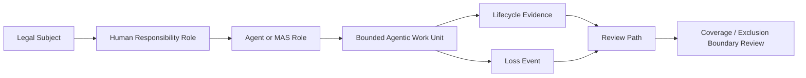

# Responsibility Bridge Source Diagram

This source is retained for internal R15C figure provenance only. Raw Mermaid must not appear in rendered HTML/PDF artifacts.

```mermaid
flowchart LR
    LS[Legal Subject] --> HR[Human Responsibility Role]
    HR --> AR[Agent or MAS Role]
    AR --> WU[Bounded Agentic Work Unit]
    WU --> EV[Lifecycle Evidence]
    WU --> LE[Loss Event]
    EV --> RP[Review Path]
    LE --> RP
    RP --> CB[Coverage / Exclusion Boundary Review]
```
