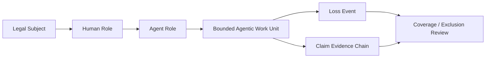

# Agentic AI Insurability & Risk Transfer White Paper 2026
## A Lifecycle Evidence Guide for Underwriting, Claims, and Enterprise Risk Transfer

**Document ID:** `AIIRWP-2026-v0.2-R10-PUBLICATION-GRADE-REWRITE`
**Status:** Publication-grade rewrite source only. Not public release. Not final. Not sealed.
**Series:** Agentic Lifecycle Governance Industry Series
**Series Position:** 03 / Insurability & Risk Transfer
**Author:** Jearon Wong

## 0. Executive Thesis - AI Agents Are Not the Insured Subject

AI agents are not the insured legal subject. They are agentic risk objects whose actions must be mapped back to human roles, corporate responsibility, coverage boundaries, and reconstructable lifecycle evidence. That is the core problem this paper solves. A company may be insured. A person, officer, professional, or vendor may be insured. The AI agent usually is not. Yet the agent can act, delegate, call tools, cross systems, and trigger losses. Insurance therefore has to answer a harder question than "what model ran?" It has to answer "who is covered, what work was done, what event occurred, who owned the responsibility path, and what evidence can reconstruct the loss?" [1][3][5][7]

AI insurance already exists at the edges, but agentic insurability remains unresolved. Public sources show narrow AI-specific offerings, AI-linked cyber endorsements, professional-liability discussion, and boundary questions about exclusions and sublimits. They do not show a widely accepted lifecycle object layer for agentic work. This paper defines that missing layer in plain English and keeps the boundary visible: it does not claim coverage, insurer acceptance, certification, legal advice, or an underwriting standard. [2][8][9]

| This paper defines | This paper does not claim |
| --- | --- |
| a subject / object / responsibility / evidence split for agentic AI | a coverage opinion |
| AIO as an analytical insurability object layer | a standard or policy form |
| AIRM as readiness vocabulary | a score, benchmark, or certification |
| a claim evidence chain for post-loss review | claim approval or payment |
| dispute-ready risk-transfer language | legal advice or legal proof |

The paper is written for an insurer, broker, reinsurer, claims, risk, legal, governance, or enterprise reader who needs to understand one thing first: agentic AI risk is lifecycle risk. It is not only model risk. It is not only cyber risk. It is the risk that comes from action, delegation, handoff, dependency, loss, and reconstruction. [3][4][5][6][7]

## 1. Why Agentic AI Breaks Today’s Insurance Logic

### Reader problem

Insurance needs a subject, a risk, an event, a responsibility path, and evidence. Agentic AI complicates all five at once. The system can plan, hand off work, invoke tools, reuse memory, and continue after the human who approved it is no longer in the loop. A static model label does not describe that chain. [1][3][4][5]

### Concrete scenarios

First, imagine a customer-refund agent that resolves support tickets, issues credits, and updates account records. If the refund is wrong, the insurer does not just need the log line that says "refund issued." It needs to know who was insured, who authorized the lane, what the agent was allowed to do, whether the action stayed inside the delegated scope, what loss followed, and what evidence still exists. [1][3][6]

Second, imagine a finance workflow agent that uses an external tool API to send payment instructions. The tool call may be technically valid while still being business-wrong. A log can show the call. It cannot by itself prove authority, responsibility, boundary, or claim relevance. [3][4][6]

### Plain-English argument

The insurance question changes when work becomes agentic. The insurer is no longer only reviewing an output. It is reviewing a chain of actions that can span humans, agents, vendors, tools, dependencies, and remediation. That is why lifecycle evidence matters: it is the only way to reconstruct what happened without pretending that a model name is the exposure boundary. [5][6][7]

Agentic AI risk is therefore not a simple yes/no cover question. It is a review question. Can the work be bounded, attributed, reconstructed, remediated, and disputed? If the answer is no, broad risk transfer remains hard to discuss in serious terms. [2][3][7][8]

### Transition

Before any policy conversation can make sense, the paper has to answer the first insurance question: who is actually insured?

## 2. The First Question: Who Is Actually Insured?

### Reader problem

Insurance still starts with a legal or contractual subject. The policy attaches to a person, company, officer, professional, vendor, or organization. It does not start with a model name. That distinction matters because an AI agent can act without being the insured subject. [1]

### Scenario

If a support team uses an agent to recommend a refund, the company may be the insured party. A manager may be the decision owner. The agent may be the acting layer. None of that is the same as saying the agent itself is the insured subject. The subject question has to come first. [1][5]

### Table: insured subject versus agentic complication

| Traditional insurance question | Agentic AI complication | Needed lifecycle evidence |
| --- | --- | --- |
| Who is insured? | The agent may act, but the insured subject is usually a company, person, officer, professional, vendor, or organization. | Named subject, role map, policy relation. |
| Who is responsible? | HITL is not the same as a responsibility path. | Human role, owner, reviewer, escalator, remediator. |
| What is in scope? | A model name or workflow label does not bound the exposure. | Work-unit scope, authority, tools, data, time window. |
| What can be disputed? | The loss story may be split across people, tools, and vendors. | Event record, boundary facts, remediation record. |

### Plain-English argument

The safe sentence is simple: an AI agent is generally a tool or actor, not the insured legal subject. That does not decide liability, and it does not decide coverage. It only keeps the insurance analysis anchored to the right starting point. [1][7]

If a paper gets this wrong, everything later becomes mushier than it needs to be. The insurer starts with the policy relation, then moves to the risk object, then to responsibility, then to evidence. That sequence is not optional. It is how insurance reasoning works. [1][3][7]

### Transition

Once the subject is clear, the next question is even more important: what exactly is the insurable agentic risk object?

## 3. The Second Question: What Is the Insurable Agentic Risk Object?

### Reader problem

A model name is not enough. A workflow name is not enough. A vendor name is not enough. An agent persona is not enough. Insurance needs a bounded object that can be reviewed as work, not just as software. [2][4][7]

### Scenario

An agent that "approves refunds" is a different exposure from an agent that only drafts recommendations. The same model can sit inside both. The real object is the bounded agentic work unit: scope, authority, tools, data, human role, time, expected outcome, and evidence. [5][6][7]

### Plain-English argument

This paper defines the insurable agentic risk object as a bounded agentic work unit. That is an authored definition, not an external standard. It is the smallest useful object that still lets an insurer or claims reviewer ask whether the work can be reconstructed. [7]

The point of the definition is not to make the paper more technical. The point is to stop the conversation from collapsing into labels. A label tells you what the system is called. A bounded work unit tells you what the system was allowed to do, how it was supposed to do it, and what evidence should exist if something went wrong. [4][5][6][7]

### Transition

The object is not enough by itself. The next step is the responsibility bridge that connects human roles, agent roles, and corporate liability paths.

## 4. The Responsibility Bridge: Human Roles, Agent Roles, and Corporate Liability Paths

### Reader problem

HITL is not responsibility mapping. An approval click is not a liability structure. Role names in a multi-agent system are not the same thing as legal accountability. Insurance needs to connect action to responsibility, not just to presence. [5][6][7]

### Diagram

### Scenario

Suppose a finance manager approves an agent-assisted payment lane. The approval does not automatically tell the insurer whether the agent stayed within delegated scope, whether a tool action was authorized, whether a vendor dependency changed the event, or whether the loss can be reconstructed. The human role, agent role, work unit, evidence, and event all need to line up. [3][4][5][6]

### Plain-English argument

The bridge is this: Legal Subject -> Human Role -> Agent Role -> Bounded Agentic Work Unit -> Loss Event -> Claim Evidence Chain -> Coverage / Exclusion Review. That chain does not settle liability. It gives the reviewer a path. [5][6][7]

That distinction is important. Many systems can show what happened. Fewer can show who owned the work, what authority existed, what boundary was crossed or preserved, and what evidence remains after the event. Without that bridge, the insurer is left with fragments. [3][6][7]

### Transition

Once the bridge is visible, the market question becomes easier to state: what does AI insurance cover today, and why does that still leave agentic work exposed?

## 5. What AI Insurance Covers Today - and Why It Still Leaves Agentic Work Exposed

### Reader problem

The public market already contains AI-specific or AI-linked coverage discussion. That fact matters. But it does not mean the market has solved broad agentic lifecycle risk transfer. Public sources still read like edge cover, conditional cover, or multi-line exposure discussion. [2][8][9]

### Table: market edge versus lifecycle gap

| Market edge | What public sources show | Why it still falls short |
| --- | --- | --- |
| AI-specific performance or error cover | AI provider and deployer examples exist, including product-level AI risk transfer discussion. [2] | Product existence does not create a common object layer for agentic work. |
| AI-linked cyber and LLMjacking cover | Cyber endorsements and threat discussion show AI can sit inside cyber wording and loss context. [2][8][9] | Cyber logs and controls do not by themselves map responsibility or claim evidence. |
| E&O and D&O context | Public sources discuss professional liability and board-level AI exposure. [1][2] | The subject remains the professional, firm, or board actor, not the AI agent. |
| Silent AI risk, exclusions, and sublimits | Public sources point to boundary questions, not universal consensus. [2][8] | Boundary questions are not broad risk-transfer proof. |

### Plain-English argument

The public source base points to fragmentation, not resolution. Some sources discuss AI-specific products. Some sources discuss cyber-linked AI perils. Some sources discuss professional liability or governance exposure. Some sources discuss exclusions, limits, and silent risk. None of that equals a standardized lifecycle object layer for agentic work. [2][8][9]

The important thing is not to overstate the market. The market shows interest and adaptation. It does not show a settled answer to the agentic question. That is why this paper stays careful: it treats the market edge as a signal, not as proof that broad agentic AI risk transfer already exists. [2][8]

### Transition

The next question is the one claims teams and risk reviewers eventually ask anyway: why are logs, traces, and vendor assurances not enough on their own?

## 6. Why Logs, Traces, and Vendor Assurances Are Not Claim Evidence

### Reader problem

Logs are useful. Traces are useful. Vendor assurances are useful. None of them is sufficient by itself. A claim needs more than event capture. It needs authority, responsibility, causality, boundary, and remediation linkage. [3][4][6]

### Table: evidence ingredients versus claim evidence

| Artifact | Useful for | Not sufficient for | Needed additional linkage |
| --- | --- | --- | --- |
| Logs | Sequence, timing, basic activity | Authority, responsibility, loss reconstruction | Role map and work-unit scope |
| Traces | Tool calls, handoffs, execution path | Coverage boundary or claim package | Event context and causality trace |
| Vendor assurances | Capability claims, feature summaries | Dispute-ready evidence | Independent responsibility and boundary facts |
| Workflow completion | Output status | Loss causation or claim outcome | Event record and remediation record |

### Plain-English argument

This is not an attack on vendors or frameworks. Vendor docs are technical evidence ingredients. They explain what a system can do. They do not, by themselves, prove who owned the work, whether the action stayed in scope, or how the event should be read against a policy boundary. [4][6]

The claim question is harder than the logging question. Claim evidence has to survive disagreement. It has to work after the event, when people remember differently and the system has moved on. That is why claim evidence is a chain, not a screenshot. [3][6][7]

### Transition

That distinction leads directly into the translation layer between compliance, auditability, and insurability.

## 7. From Compliance and Auditability to Insurability

### Reader problem

Compliance asks whether lifecycle governance exists. Auditability asks whether lifecycle evidence can be reviewed. Insurability asks whether loss, responsibility, causality, and coverage boundary can be reconstructed. Those are related questions, but they are not the same question. [5][6][7]

### Plain-English argument

WP1 gives the governance object layer. WP2 gives the audit evidence layer. WP3 uses both, but only to move into risk-transfer language. That translation is the point of the paper. It does not collapse the earlier papers into insurance claims. It extends them into a new question: how does this become reviewable for risk transfer? [5][6][7]

### One concise mapping table

| Source layer | WP3 translation | Why it matters |
| --- | --- | --- |
| WP1 MRO / ALCS | Insurable object and lifecycle conformance context | Gives the work-unit and responsibility vocabulary. [5] |
| WP2 Audit Evidence Chain | Claim Evidence Chain | Gives the post-loss reconstruction path. [6] |
| WP2 AARM | AIRM readiness vocabulary | Gives the maturity language without pretending to certify. [6][7] |
| WP3 synthesis | Risk-transfer review language | Keeps the paper about insurability, not audit or compliance alone. [7] |

### Transition

Once that translation is clear, the paper can finally introduce its own central object layer: AIO.

## 8. Agentic Insurability Objects: The Missing Evidence Layer

### Reader problem

AIO is the paper’s analytical object layer. It is not a standard. It is not a policy form. It is not an insurer requirement. It is a way to keep the risk discussion from dissolving into labels and anecdotes. [7]

### Plain-English argument

The best way to understand AIO is by grouping the objects by purpose rather than by raw count. That keeps the paper readable. It also makes clear that the point is not completeness for its own sake. The point is reviewability. [7]

### Grouped overview

| AIO group | Representative objects | What the group answers |
| --- | --- | --- |
| Subject and work boundary | AIO-01, AIO-02, AIO-04, AIO-05 | Who is covered, what work is in scope, and where the boundary sits. |
| Responsibility and authority | AIO-03, AIO-05 | Who owned the work and what the agent was allowed to do. |
| Loss and causality | AIO-06, AIO-07, AIO-08, AIO-10 | What happened, how it unfolded, what failed, and what was fixed. |
| Dependency and aggregation | AIO-11, AIO-13 | Which vendors, tools, models, or concentrations matter. |
| Claim and dispute readiness | AIO-09, AIO-12, AIO-14 | Whether the event can be reviewed as a claim and disputed coherently. |

### Scenario

If the bounded work unit is "approve refund," the AIO layer asks different questions than a model card would ask. Who was the insured subject? What exactly was delegated? Which tool was used? What data was in play? What loss event followed? What evidence still exists? Those are insurability questions, not model-comparison questions. [5][6][7]

### Transition

Once the object layer exists, the paper can introduce its readiness vocabulary: AIRM.

## 9. Agentic Insurability Readiness Model

### Reader problem

AIRM is readiness vocabulary, not certification, insurer acceptance, an actuarial score, a coverage guarantee, claims approval guidance, or a procurement benchmark. It is a way to describe whether the lifecycle evidence is thin, partial, reviewable, or dispute-ready. [7]

### Matrix

| Level | Label | What is visible | What it means | Boundary |
| --- | --- | --- | --- | --- |
| L0 | Unobservable | Very little reconstructable evidence | The work cannot be reviewed as lifecycle work. | Not a coverage or certification judgment. |
| L1 | Log-visible | Basic activity logs | Something happened, but ownership is weak. | Logs are not enough. |
| L2 | Trace-linked | Tool calls, handoffs, partial path data | The chain is visible in part. | Not underwriting-ready by itself. |
| L3 | Evidence-structured | Linked evidence objects | The work is reviewable after loss. | Not claim-approved. |
| L4 | Underwriting-ready | Strong pre-loss visibility | The evidence can support serious risk review. | Not insurer acceptance. |
| L5 | Dispute-ready | Robust chain across boundary, loss, remediation, and role | The architecture can survive challenge and review. | Not certification. |

### Plain-English argument

The ladder is descriptive. It says how visible and reconstructable the work is. It does not say that a system is covered. It does not say that an insurer must accept it. It does not say that a claim will be paid. It only says how much evidence the system can carry when the question turns serious. [3][6][7]

That distinction matters because people often confuse readiness with outcome. Readiness is architecture. Coverage is a contract question. They overlap, but they are not the same thing. [1][7]

### Transition

The conclusion ties everything together: the route to risk transfer is not more hype, but more bounded, attributable, reconstructable, remediated, and disputable work.

## 10. Conclusion - From Agent Deployment to Dispute-Ready Risk Transfer

Agentic AI becomes more insurable when its work becomes bounded, attributable, reconstructable, remediated, and disputable. That is the category definition this paper leaves behind. It does not guarantee insurance. It does not certify a product. It does not claim insurer acceptance. It gives the language needed for serious risk-transfer discussion. [2][3][7][8]

The practical lesson is simple. If the subject is unclear, the object is too broad, the authority path is hidden, the logs are thin, the dependency map is missing, or the remediation record is incomplete, the risk-transfer conversation will stay vague. If the work is bounded and the evidence chain survives disagreement, the conversation gets real. [1][3][6][7]

This paper therefore closes at the boundary of language and reviewability. Future WP4 can translate compliance, auditability, and insurability into implementation synthesis. R10 stops here on purpose. It defines the language, not the deployment plan. [5][6][7]

## Appendix A. Source Notes and Method Boundary

This appendix converts the body’s source references into numbered source notes. The body uses [1] through [9] instead of raw source tags.

### Source note index

| Note | What it covers | Primary source families | Used in |
| --- | --- | --- | --- |
| [1] | Insurance subject and policy structure basics | INS-04, INS-06, INS-07, INS-08 | Chapters 2, 3, 4, 10 |
| [2] | AI market-edge cover and fragmented response | MKT-01, MKT-02, MKT-03, MKT-05, MKT-06, MKT-08 | Chapters 0, 5, 10 |
| [3] | Claims reconstruction, incident response, and event sequencing | CLAIM-01, CLAIM-02, CLAIM-03 | Chapters 0, 1, 4, 6, 9, 10 |
| [4] | Technical agent, tool, and protocol context | TECH-01, TECH-02, TECH-03, TECH-04, TECH-05 | Chapters 1, 3, 4, 6 |
| [5] | WP1 source truth | INT-01, INT-02, INT-03 | Chapters 0, 4, 7, 8 |
| [6] | WP2 source truth | INT-04, INT-05 | Chapters 0, 4, 6, 7, 9 |
| [7] | WP3 synthesis layer | INT-06, INT-07 | Chapters 0, 3, 4, 7, 8, 9, 10 |
| [8] | Dependency, aggregation, and cyber accumulation context | CYB-01, CYB-02, CYB-03, CYB-04, CYB-05, MKT-08 | Chapters 0, 5, 8, 10 |
| [9] | AI governance and regulatory pressure context | INS-01, INS-02, INS-03, AI-01, AI-02 | Chapters 5, 7 |

### Method boundary

- Source notes are a publication-facing bridge, not a raw register dump.
- Source notes support body claims; they do not replace the source register in the R0-R9 reports.
- Synthesis claims remain authored claims. They must be labeled as "this paper defines" or equivalent when first introduced.
- The body should remain readable without needing the raw source marker language that existed in the earlier internal draft.

## Appendix B. Agentic Insurability Objects Reference

| Group | AIO | Plain-English label | Why it matters | Boundary |
| --- | --- | --- | --- | --- |
| Subject and work boundary | AIO-01 | Legal insured subject | Names the covered party. | Not legal advice. |
| Subject and work boundary | AIO-02 | Insurable agentic work unit | Binds exposure to bounded work. | Not a policy form. |
| Responsibility and authority | AIO-03 | Human-agent responsibility map | Links action back to human role. | Not liability finding. |
| Subject and work boundary | AIO-04 | Coverage boundary | Frames scope, exclusion, and limit questions. | Not coverage opinion. |
| Responsibility and authority | AIO-05 | Authority and delegation boundary | Separates permission from business authority. | Not coverage authority. |
| Loss and causality | AIO-06 | Loss event record | Anchors event, time, and consequence. | Not proof of loss alone. |
| Loss and causality | AIO-07 | Causality reconstruction trace | Links sequence and contributors. | Not legal causation proof. |
| Loss and causality | AIO-08 | Control failure record | Shows failed or bypassed control. | Not negligence finding. |
| Claim and dispute readiness | AIO-09 | Claim evidence chain | Packages reviewable evidence. | Not claim approval. |
| Loss and causality | AIO-10 | Remediation and recovery record | Shows containment and closure. | Not legal closure. |
| Dependency and aggregation | AIO-11 | Vendor / model / tool dependency map | Shows dependency concentration. | No vendor ranking. |
| Subject and work boundary | AIO-12 | Exclusion trigger / boundary breach map | Helps review boundary facts. | Not exclusion determination. |
| Dependency and aggregation | AIO-13 | Aggregation and accumulation risk view | Shows correlated exposure. | Not actuarial proof. |
| Claim and dispute readiness | AIO-14 | Dispute-ready claim package | Organizes evidence for review. | Not guaranteed payment. |

## Appendix C. AIRM Readiness Reference

| Level | Label | Evidence visibility | Insurance reading | Boundary |
| --- | --- | --- | --- | --- |
| L0 | Unobservable | Very low | Hard to review as lifecycle work. | Analytical label only. |
| L1 | Log-visible | Low | Events visible, ownership weak. | Logs are not enough. |
| L2 | Trace-linked | Medium | Some scope visible, chain incomplete. | Not underwriting-ready. |
| L3 | Evidence-structured | Good | Reviewable after loss. | Not claim-approved. |
| L4 | Underwriting-ready | High | Strong pre-loss evidence. | Not insurer acceptance. |
| L5 | Dispute-ready | Very high | Review and dispute readiness are robust. | Not certification. |

## Appendix D. Boundary and Non-Claim Language

### Avoid

- coverage-ready
- underwriting-ready
- insurer accepted
- certification
- endorsement
- legal proof
- insurance advice
- legal advice
- coverage opinion
- underwriting standard
- claims approval guidance
- external adoption proof
- indexing proof
- SEO or GEO outcome proof
- Final Seal

### Replace with

- reviewable
- readiness for discussion
- boundary-sensitive
- source-backed
- analytical
- dispute-ready
- not final
- not sealed
- not public release

### Safe replacement examples

- "This paper defines a reviewable language for risk-transfer discussion."
- "This paper does not claim coverage or insurer acceptance."
- "AIRM describes readiness, not certification."
- "AIO is an analytical object layer, not a standard."
- "Logs are useful inputs, not claim evidence by themselves."

