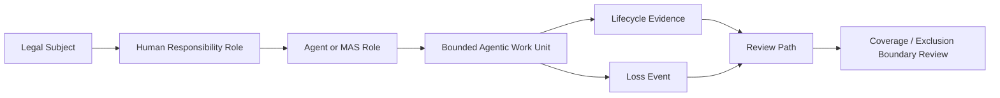

# Agentic AI Insurability & Risk Transfer White Paper 2026
## A Lifecycle Evidence Guide for Underwriting, Claims, and Enterprise Risk Transfer

**Document ID:** `AIIRWP-2026-v0.3-R12-BODY-EXPANSION-REWRITE`
**Status:** Body expansion rewrite source only. Not public release. Not final. Not sealed.
**Series:** Agentic Lifecycle Governance Industry Series
**Series Position:** 03 / Insurability & Risk Transfer
**Author:** Jearon Wong

## 0. Executive Thesis - AI Agents Are Not the Insured Subject

A company can buy insurance. A professional can be insured. A director, officer, vendor, or organization can sit inside a policy relationship. An AI agent usually does not. That single distinction is where the agentic AI insurance problem begins.

The problem is not that AI is absent from insurance. It is already visible at the edges of the market: in AI-specific product examples, cyber risk discussion, governance expectations, professional liability questions, and boundary debates around exclusions, sublimits, and silent exposure. The harder problem is that agentic AI does not behave like a static software tool. It can take steps, call tools, pass work to another system, use external data, continue across sessions, and produce consequences that are not obvious from the final output alone. When an agentic workflow creates loss, the question is not only "which model was used?" The question is "who was insured, what work was delegated, who held responsibility, what authority existed, what boundary was crossed, what dependency contributed, what loss occurred, and what evidence can still reconstruct the event?" [1][2][3][4]

This paper's governing thesis is direct:

AI agents are not the insured legal subject. They are agentic risk objects whose actions must be mapped back to human roles, corporate responsibility, coverage boundaries, and reconstructable lifecycle evidence.

Consider a customer operations team that deploys an agent to triage support tickets, approve routine refunds, update account records, and escalate unusual cases. The company may think of that agent as a productivity layer. A risk executive sees a control surface. A claims reviewer sees a possible event chain. If a bad refund sequence triggers a contractual dispute, customer harm, regulatory complaint, or financial loss, the organization will not be helped by a vague statement that "the AI made the decision." It will need to show what work the agent was allowed to do, who approved the lane, which records were used, which tool call changed the account, whether the action stayed within delegated scope, and how the company responded after the loss. Logs may help. They are not the whole evidence story. [3][4][6]

That is why agentic AI risk is lifecycle risk. It is not only model risk. It is not only cyber risk. It is not only governance risk. It is the risk that emerges when automated work becomes action, action becomes business effect, business effect becomes loss, and loss has to be reconstructed across people, systems, tools, vendors, and evidence. [5][6][7]

This paper defines the missing insurability language for that problem. It does not decide whether a policy covers a loss. It does not declare that agentic AI is broadly insurable or uninsurable. It does not certify systems, advise insureds, or set an underwriting standard. It defines a reviewable object layer and a readiness vocabulary for serious risk-transfer discussion.

| This paper defines | This paper does not claim |
| --- | --- |
| a subject / object / responsibility / evidence split for agentic AI | a coverage opinion |
| AIO as an analytical insurability object layer | a standard or policy form |
| AIRM as readiness vocabulary | a score, benchmark, or certification |
| a claim evidence chain for post-loss review | claim approval or payment |
| dispute-ready risk-transfer language | legal advice or legal proof |

The intended reader is an insurer, broker, reinsurer, claims professional, risk executive, counsel, board member, CIO, CTO, or AI governance leader who can already see the shape of the next problem. Enterprises are not merely asking whether they can deploy AI agents. They are asking what happens when those agents act inside workflows that matter: finance, legal operations, customer service, software delivery, procurement, claims handling, compliance, and professional services. Insurance cannot engage that problem seriously unless the work can be bounded, attributed, reconstructed, remediated, and disputed. [1][3][5][6][7]

The executive pressure is timing. Agentic workflows are being adopted before insurance language has fully caught up. That does not make adoption irresponsible by itself, and it does not make insurance unavailable by itself. It means the evidence burden is moving closer to the enterprise. If a company cannot explain the agent's work before loss, it will struggle to reconstruct it after loss. If it cannot reconstruct the work after loss, risk transfer becomes a conversation about incomplete fragments. [3][6][7]

That burden is manageable only if the organization treats evidence design as part of deployment design from the beginning.

The rest of this paper moves in that order. It first explains why agentic AI breaks the usual insurance logic. It then separates the insured legal subject from the agentic risk object. It builds the responsibility bridge between human roles, agent roles, work units, loss events, and evidence. It maps current AI insurance signals without overstating them. Only after that foundation does it introduce Agentic Insurability Objects and the Agentic Insurability Readiness Model as Jearon Wong analytical synthesis for the risk-transfer discussion.

## 1. Why Agentic AI Breaks Today's Insurance Logic

Insurance needs a subject, a risk, an event, a responsibility path, and evidence. Agentic AI complicates all five at once.

The subject is the person, company, officer, professional, vendor, or organization that sits inside the policy relationship. The risk is the exposure being transferred or reviewed. The event is the occurrence, act, error, failure, breach, injury, loss, or disputed sequence that brings the risk into focus. The responsibility path is the human and corporate route by which action is authorized, supervised, escalated, remediated, and explained. Evidence is the material that lets a reviewer reconstruct what happened after people disagree, systems have moved on, and the loss has already occurred. [1][3]

A traditional software failure can be difficult enough. An agentic failure is harder because the relevant work may not sit in one place. The model may plan. The agent framework may orchestrate. The tool protocol may connect to external systems. The enterprise platform may enforce some guardrails. A human may approve an objective but not each step. A vendor may provide infrastructure but not own the business decision. A log may show the call, but not the business authority. A trace may show the handoff, but not the insured subject. [4][6]

That is the break. The final output is no longer the whole risk story.

Imagine a customer refund agent inside a subscription business. The agent receives customer messages, checks purchase history, applies refund rules, updates a billing platform, posts a note in the customer account, and closes the ticket. For months, the workflow appears efficient. Then a batch of refunds is issued incorrectly. Some customers receive credits they should not have received. Others are denied credits they should have received. A compliance complaint follows because a special category of customers was treated inconsistently.

The company can produce logs. The logs show timestamps and tool calls. But an insurer, risk executive, or claims reviewer would need more than that. They would need to know who the insured subject is, who approved the refund lane, what authority the agent had, what rule set applied, whether the agent stayed inside that scope, which data source was used, whether a human reviewed edge cases, what control failed, what financial or customer harm followed, and what remediation took place. A line that says "refund issued" is evidence of activity. It is not a reconstruction of insurable work. [3][4][6]

Now change the scenario. A finance operations agent prepares payment instructions using an external tool API. The agent reads an invoice, checks a vendor record, creates a payment instruction, and sends it to a payment workflow. The tool call is valid in the technical sense. The credential works. The API accepts the request. The workflow completes. Later the business discovers that the payment went to the wrong account because the agent resolved a vendor identity incorrectly after a data synchronization issue. The tool did what it was asked to do. The workflow completed. The loss still exists.

This is why workflow completion is not an insured outcome. Tool permission is not coverage authority. Framework trace is not claim evidence by itself. Technical validity and insurance relevance are different layers. [4][7]

The same pattern appears in professional services. A firm uses an AI-assisted research and drafting workflow for client deliverables. A human partner reviews the final memo, but the agent gathered source material, summarized documents, proposed conclusions, and inserted citations. If the work later becomes disputed, the risk-transfer question is not only whether the final memo contained an error. It is whether the firm can reconstruct the role of the human professional, the role of the agent, the work boundary, the evidence relied upon, the client-facing consequence, and the remediation path. Professional liability analysis still attaches to a professional or firm context. The AI agent does not become the insured professional simply because it contributed to the work. [1][10]

Static labels fail because they compress this whole chain into the wrong object. A model label tells the reviewer which model family may have produced output. A workflow name tells the reviewer what the business team called the automation. A vendor name tells the reviewer which platform or provider was involved. An agent persona tells the reviewer how the system was configured to behave. None of those labels, by itself, tells the reviewer what the bounded work was, who authorized it, what it touched, what limits applied, what loss event occurred, what evidence exists, or how the company remediated the issue. [4][7]

This is also why agentic AI can create a recognition gap inside the enterprise. The technical team may see a successful run. The business team may see a completed task. The customer may see an outcome. The risk team may see an exposure. The claims team may later see an event chain. If those views are not linked before the loss, the organization has to reconstruct them under pressure after the loss. The more autonomous and cross-system the workflow becomes, the more expensive that reconstruction becomes. [3][4][6]

The insurance problem therefore becomes a lifecycle problem. The question is not "did the enterprise use AI?" The question is whether the relevant agentic work can be bounded before the loss and reconstructed after the loss. If it cannot, the risk-transfer conversation stays vague. If it can, the conversation becomes more serious because the reviewer can follow a chain rather than argue about abstractions. [3][5][6][7]

This does not mean every bounded workflow is covered. It does not mean every reconstructable loss is payable. It means the discussion has moved from hype to review. Insurance needs that move. Without it, agentic AI risk remains a fog of model names, tool logs, vendor assurances, governance slides, and incident memories.

The first step out of that fog is the oldest insurance question: who is actually insured?

## 2. The First Question: Who Is Actually Insured?

Insurance starts with a legal or contractual subject. The policy attaches to a person, company, officer, professional, vendor, organization, or other recognized insured relationship. It does not start with the software layer that happened to act. That point sounds basic until agentic AI enters the workflow. Then it becomes the organizing question. [1]

An AI agent may be the immediate actor in an operational sense. It may send the message, execute the tool call, draft the response, update the account, or pass work to another agent. But being an actor is not the same thing as being the insured subject. A tool can act in the world through an organization. A system can change records. A workflow can trigger loss. The insurance relationship still has to be traced back to the party, role, duty, policy path, or corporate responsibility structure that insurance can recognize. [1][7]

This distinction matters because claim review can otherwise start in the wrong place. If the reviewer asks "what did the AI do?" before asking "who is insured?" the analysis can become technically rich but structurally weak. It may describe the agent's behavior in detail while leaving the policy subject, responsibility route, and evidence relevance unclear.

Take the refund agent again. The company may be the insured organization. A customer operations leader may own the workflow. A finance manager may set the refund thresholds. A support agent may handle escalations. The AI agent may execute routine cases. If a loss follows, the insured subject is not automatically the AI layer. The reviewer has to map the agent's action back to the company, the human role, the delegated authority, and the relevant policy path. [1][3]

The same is true for professional service work. A consultant, lawyer, accountant, engineer, broker, or other professional may use an AI assistant. The assistant can draft, summarize, classify, or research. If the work becomes disputed, the professional duty and firm responsibility do not disappear into the tool. The agentic layer may be central to the facts, but the insured subject remains a human, firm, or organization context unless a specific arrangement says otherwise. This paper does not interpret those arrangements. It only states the necessary starting point: the agentic actor and the insured subject are different concepts. [1][10]

| Traditional insurance question | Agentic AI complication | Needed lifecycle evidence |
| --- | --- | --- |
| Who is insured? | The agent may act, but the insured subject is usually a company, person, officer, professional, vendor, or organization. | Named subject, role map, policy relation. |
| Who is responsible? | HITL is not the same as a responsibility path. | Human role, owner, reviewer, escalator, remediator. |
| What is in scope? | A model name or workflow label does not bound the exposure. | Work-unit scope, authority, tools, data, time window. |
| What can be disputed? | The loss story may be split across people, tools, and vendors. | Event record, boundary facts, remediation record. |

The consequences are practical. The policy path may differ depending on whether the loss looks like cyber, professional liability, management liability, errors and omissions, contract exposure, regulatory response, or another line-specific context. Limits and exclusions may turn on facts that are not visible in a model trace. Responsibility may depend on who approved the workflow, who supervised the lane, who controlled the data source, who remediated the event, and who owed the relevant duty. None of that is solved by naming the agent. [1][10][11]

This is why the safe sentence must be simple: the company may be insured. The AI agent usually is not.

The sentence does not decide liability. It does not decide coverage. It does not say agentic AI cannot be involved in insured losses. It keeps the analysis anchored to the correct first object. Once the subject is clear, the next question can be asked with more precision: what exactly is the agentic risk object that needs to be reviewed?

## 3. The Second Question: What Is the Insurable Agentic Risk Object?

If the agent is usually not the insured subject, then the next question is what the insurer, broker, reinsurer, claims reviewer, or enterprise risk leader should look at. A model is too broad. A workflow name is too vague. A vendor platform is too indirect. An agent persona is too theatrical. The useful object is the bounded agentic work unit. [4][7]

This paper uses "bounded agentic work unit" as Jearon Wong analytical synthesis. It is not a policy form, standard, or external market requirement. It is a publication-facing way to name the smallest unit of agentic work that can support serious risk-transfer review.

A bounded agentic work unit has scope. It has a business purpose. It has data inputs. It has tools. It has authority limits. It has human roles around it. It has a time window. It has an accepted outcome. It has evidence that should exist before and after the work. Without those elements, the reviewer is left with labels. With them, the reviewer can ask what happened in a way that is specific enough to matter. [5][6][7]

Return to the customer support example. "Approve refund" is not one risk object unless the boundaries are specified. The same words can describe very different work:

- Draft a refund recommendation for human approval.
- Approve refunds below a defined amount for ordinary customers.
- Approve refunds for all customers except regulated accounts.
- Approve refunds and update the billing system.
- Approve refunds, change account status, and trigger a retention offer.

Each version touches different authority, data, tools, controls, and loss paths. If a company tells a reviewer only that it used a "refund agent," the reviewer still does not know the risk. If the company defines the bounded work unit, the conversation becomes grounded: this agent could approve refunds up to a threshold, using these data sources, through this billing tool, under this human owner, with these escalation rules, during this time window, with these logs and account-change records available after the event. [3][4][6][7]

The same logic applies to a regulatory-response workflow. "Generate regulatory response" may mean drafting an internal summary, preparing a first-pass answer for counsel, populating a filing template, sending a response to a regulator, or updating a compliance record. Those are not the same risk object. The difference matters because an insurer or enterprise reviewer may care about who approved the work, whether the output was sent externally, what sources were used, which human role reviewed the text, what deadline pressure existed, and what evidence remains if the response is later challenged. [3][6][9]

Model names do not solve this. The same model can be used in a harmless drafting lane and a high-stakes customer-impact lane. Workflow names do not solve it. A workflow can change over time while the label stays the same. Vendor names do not solve it. A vendor may provide infrastructure without owning the business effect. Agent personas do not solve it. A persona can be useful for design, but it does not define insured subject, authority, policy boundary, loss event, or evidence chain. [4][7]

The bounded work unit is necessary because insurance review needs a stable object. It needs something to ask about before loss and something to reconstruct after loss. The object must be specific enough to show what work was delegated and narrow enough that responsibility, authority, dependency, evidence, and remediation can be attached to it. [7]

This is the point where many AI governance discussions stop too early. They ask whether the model is safe, whether the workflow has logs, whether a human is in the loop, or whether the vendor has controls. Those questions matter. They are not the same as asking whether the agentic work unit is insurable as a risk object for review. That question requires the next layer: the responsibility bridge.

## 4. The Responsibility Bridge: Human Roles, Agent Roles, and Corporate Liability Paths

Human-in-the-loop is not responsibility mapping. An approval button is not a liability structure. A role name inside a multi-agent system is not a corporate accountability path. Insurance needs a bridge between the legal subject, human responsibility, agent behavior, work boundary, loss event, evidence, and review path. [5][6][7]

The bridge is not a finding of liability. It does not decide who is legally responsible. It gives reviewers a structured path for asking what happened. That path matters because agentic work can make responsibility look deceptively simple from the outside and fragmented from the inside.

Imagine a finance organization introducing an agent-assisted vendor payment lane. A procurement analyst validates vendor records. A finance manager approves use of the lane for routine payments. The agent reads invoices, compares them with purchase orders, selects a payment code, and prepares instructions. A separate tool sends the instruction into the payment system. A human reviews exceptions, but ordinary payments pass through automatically under a threshold.

If the wrong vendor is paid, the organization may have logs for each technical step. That is useful. But the responsibility bridge asks different questions. Who was the legal subject in the policy relationship? Which human role owned the payment lane? What was the agent role? Was the work unit routine invoice matching, payment preparation, or payment execution? Which data source produced the wrong vendor identity? Was the external tool authorized for that action? What control failed? What loss event occurred? How was the payment recovered or remediated? Which evidence is needed to review the event without pretending that the agent itself was the insured party? [1][3][4][6]

This is where HITL language often becomes too weak. A human may approve the deployment, but not each action. A human may review outputs, but not tool calls. A human may handle exceptions, but not ordinary cases. A human may click approve, but only after the agent has framed the options. The phrase "human in the loop" does not say which human, in what role, at what decision point, with what information, under what authority, and with what record. [5][6][7]

An approval button has the same problem. It may show that someone clicked something. It does not automatically show that the person understood the agent's path, that the delegated authority was proper, that the tool call stayed in scope, that the policy boundary was preserved, or that the loss can be reconstructed. Approval is a fact. Responsibility mapping is a structure.

The bridge this paper uses is:

Legal Subject -> Human Responsibility Role -> Agent/MAS Role -> Bounded Agentic Work Unit -> Lifecycle Evidence -> Loss Event -> Review Path -> Coverage / Exclusion Boundary Review.

Each link prevents a common failure. Legal subject prevents the agent from being treated as the insured party. Human responsibility role prevents HITL from becoming a vague comfort phrase. Agent/MAS role prevents technical activity from disappearing. Bounded work unit prevents labels from replacing scope. Lifecycle evidence prevents logs from being mistaken for claim packages. Loss event prevents governance from floating above actual harm. Review path prevents the paper from pretending to decide coverage or liability. [3][5][6][7]

The review path also matters for enterprises before a loss. A CRO can ask whether the work unit has an owner. Counsel can ask whether the authority boundary is clear. A CTO can ask whether traces connect to business context. A CFO can ask whether the dependency and accumulation exposures are visible. A claims team can ask whether the event package would survive disagreement. Those questions are not the same question, but they need the same bridge. [3][6][8]

Once the bridge is visible, the market question becomes more concrete. The public market has begun to touch AI risk. It has not yet shown a broad, settled object layer for agentic lifecycle risk transfer.

## 5. What AI Insurance Covers Today - and Why It Still Leaves Agentic Work Exposed

Public market examples show that AI is already inside insurance discussion. Some sources discuss AI-specific products. Some discuss cyber exposure, including AI-linked misuse and LLMjacking. Some broker and association sources frame professional liability, management liability, silent AI, exclusions, sublimits, and multi-line exposure as developing issues. The public source base points to market adaptation. It does not point to a settled answer for broad agentic lifecycle risk transfer. [2][8][9][10][11][12]

That distinction is essential. If the paper says "AI insurance exists," the statement is too broad to help. If it says "AI agents are uninsurable," the statement overreaches in the other direction. The more accurate market reading is narrower: insurance is touching AI at the edges and through existing lines, but current public evidence does not show a common object layer that binds agentic work unit, human role, authority, loss, dependency, causality, remediation, and claim evidence. [2][12]

Targeted AI insurance and AI performance cover are one market signal. Public source records include examples of AI model performance, AI error, chatbot or GenAI risk, and product-specific risk-transfer discussion. These examples matter because they show that parts of the market can price or frame certain AI-related exposures. But they are product-specific and fact-specific. A product example does not create a general rule for agentic workflows. It does not tell a claims reviewer how to reconstruct a multi-step agent that used tools, crossed systems, relied on a vendor, and triggered a business loss. [2][12]

Cyber and AI-linked threat cover are another signal. Some sources discuss AI-enabled cyber threats, API misuse, service-fee exposure, business interruption, LLMjacking, ransomware, or cyber controls. Cyber is a natural entry point because many agentic systems connect to credentials, APIs, data stores, and operational tools. But cyber framing can still leave the agentic question unresolved. A cyber investigation may show that an API was called, a credential was used, or a service cost was incurred. It may not show whether the agent had business authority, whether the task was inside a bounded work unit, whether the loss was a professional error rather than a cyber event, or whether the policy boundary turns on facts outside the technical trace. [8][11]

Professional liability and E&O create a third category. AI-assisted professional work can affect advice, analysis, drafting, classification, research, or client service. Existing professional liability concepts may be relevant depending on the facts and policy terms. The source base supports cautious discussion of professional liability context, not a blanket conclusion. The key point for agentic AI is that the professional or firm remains the subject of the risk-transfer discussion. The agent may contribute to the work, but the evidence must reconstruct professional responsibility, reliance, review, error, client effect, and remediation. [1][10]

D&O and corporate governance exposure form a fourth category. Boards and officers are increasingly expected to understand AI governance, disclosure, oversight, and risk controls. Public sources support AI governance and corporate exposure as a risk topic. That does not make the agent the insured subject. It means the agentic workflow may become part of a governance, disclosure, oversight, or management-liability story. The relevant evidence may include board reporting, risk committee oversight, deployment approvals, incident reporting, disclosure controls, and remediation records. [9][10]

Silent AI and multi-line exposure are fifth and sixth categories. AI-related loss may enter existing policies before policy wording, exclusions, underwriting questions, and operational evidence practices fully mature. That is the nature of silent exposure: the risk is present without being cleanly named. Multi-line exposure means the same agentic event may raise questions across cyber, professional liability, management liability, crime, media, contractual, regulatory, or other contexts. This paper does not say those lines respond. It says that line uncertainty is part of the market problem. [10][11]

Exclusions, sublimits, carve-outs, and boundary uncertainty are a seventh category. Public sources support cautious statements that AI-related boundaries, limitations, and exclusions are active topics. They do not support a universal claim that the market excludes AI or broadly covers agentic AI. Exact policy wording, endorsements, and claims practice remain fact-specific and form-specific. For WP3, the implication is simpler: if the boundary is policy-specific, then the agentic evidence layer has to preserve boundary facts. [11][12]

Aggregation and accumulation signals are an eighth category. Agentic AI can create correlated dependency risk because many organizations may rely on the same model provider, cloud service, orchestration framework, tool protocol, vendor API, data source, or automated workflow pattern. Cyber aggregation sources provide an analogy and risk vocabulary. They do not provide direct actuarial proof for agentic AI. Still, the analogy is useful: if many insureds depend on similar agentic stacks, a failure or misuse pattern could concentrate exposure across organizations. A reviewer therefore needs a dependency map, not only a log. [8][12]

| Market edge | Public source signal | Why it still leaves a lifecycle gap |
| --- | --- | --- |
| AI-specific product or performance cover | Public market examples show targeted AI error, model performance, GenAI, or chatbot-related risk-transfer discussion. [2] | Product existence does not create a common object layer for agentic work-unit review. |
| Cyber / AI-linked threat / LLMjacking | Some sources discuss AI-linked cyber events, API misuse, service-cost exposure, incident response, or cyber endorsements. [8][11] | Cyber controls and logs may not map business authority, professional duty, legal subject, or claim evidence. |
| E&O / professional liability | Broker and insurance terminology sources frame professional-service mistakes and omissions as existing lines. [1][10] | The subject remains the professional or firm; agentic evidence must reconstruct responsibility and reliance. |
| D&O / corporate governance | Governance and disclosure sources frame AI oversight and board-level exposure. [9][10] | D&O context does not create an agentic lifecycle object or decide policy response. |
| Silent AI / multi-line exposure | Public sources point to uncertainty across existing lines as AI usage spreads. [10][11] | Silent exposure is a market-risk concept, not proof of coverage or exclusion. |
| Exclusions, sublimits, carve-outs | Some sources discuss boundary questions and policy limitations. [11][12] | Boundary discussion is not a universal market conclusion. Exact wording and facts matter. |
| Dependency / aggregation | Cyber aggregation and accumulation sources provide useful analogy. [8] | Cyber accumulation language does not prove agentic actuarial treatment; dependency evidence must be mapped. |

The practical market lesson is not that current insurance is irrelevant. It is that current insurance does not remove the need for agentic evidence. Existing lines may matter. Targeted products may matter. Cyber cover may matter. Professional and management liability may matter. But the agentic workflow still has to be translated into a reviewable object: subject, work unit, authority, responsibility, loss, causality, dependency, remediation, and dispute-ready evidence. [2][3][7][8][10]

For enterprise leaders, the market map creates a planning problem. A CFO may see possible risk-transfer paths in existing insurance programs. A CRO may see a need to disclose and manage agentic workflow exposure. Counsel may see policy wording, exclusions, contractual allocation, and professional duty questions. A CTO may see controls, logs, traces, vendor dependencies, and platform architecture. None of these perspectives is wrong. The problem is that they do not automatically join into one evidence layer. Current market signals make the question urgent, but they do not supply the missing object semantics. [1][3][4][8][10][11]

For insurers, brokers, and reinsurers, the same market map creates an evaluation problem. A submission that says "we use AI agents in customer operations" is not enough. A submission that says "we have logs" is not enough. A vendor summary is not enough. The reviewer needs to see what work units exist, how authority is bounded, which human roles own them, which tools and dependencies are used, which controls exist, what losses could occur, and whether post-loss reconstruction is possible. This paper does not prescribe an underwriting process. It explains why the agentic evidence layer is likely to become unavoidable in serious discussions. [3][7][8][12]

This is why Chapter 5 is the hinge of the paper. If the market had already solved broad agentic lifecycle risk transfer, AIO and AIRM would be unnecessary. If the market had no AI-related activity at all, the paper would be premature. The actual situation is more interesting: the market is adapting at the edges, while the central lifecycle object remains underdefined. That is the opening for a serious framework.

The next question follows naturally. Even if a company has logs, traces, dashboards, vendor documentation, and governance records, why are those materials still not claim evidence by themselves?

## 6. Why Logs, Traces, and Vendor Assurances Are Not Claim Evidence

Logs are useful. Traces are useful. Vendor assurances are useful. Governance records are useful. None of them is sufficient by itself. A claim, dispute, or risk-transfer review needs more than event capture. It needs authority, responsibility, causality, boundary, dependency, loss, and remediation linkage. [3][4][6]

The difference is easiest to see after a loss. Before the loss, the enterprise may look at dashboards and believe the system is observable. After the loss, the reviewer is asking a different question: can the organization reconstruct the event in a way that survives disagreement? That is not merely a technical question. It is a business, governance, evidence, and policy-boundary question. [3][6]

Return to the payment-lane scenario. The logs show the agent read an invoice, called a vendor validation API, selected a vendor record, prepared payment instructions, and sent the instruction downstream. The trace shows a clean path through the workflow. The vendor documentation says the tool can validate records. The workflow status says complete. Then the wrong vendor receives payment.

A claim reviewer or risk executive cannot stop at "the trace exists." The reviewer needs to know whether the agent was authorized to prepare payment instructions, whether the payment lane was approved for that vendor class, whether the human owner understood the scope, whether the validation source was stale, whether a control failed, whether a dependency contributed, whether remediation recovered the funds, whether customers or counterparties were harmed, and how the event maps to the policy path being reviewed. [3][4][6][8]

| Artifact | Useful for | Not sufficient for | Needed additional linkage |
| --- | --- | --- | --- |
| Logs | Sequence, timing, basic activity | Authority, responsibility, loss reconstruction | Role map and work-unit scope |
| Traces | Tool calls, handoffs, execution path | Coverage boundary or claim package | Event context and causality trace |
| Vendor assurances | Capability claims, feature summaries | Dispute-ready evidence | Independent responsibility and boundary facts |
| Governance records | Policy, approval, oversight context | Proof of loss or claim outcome | Work-unit evidence and remediation record |
| Workflow completion | Output status | Loss causation or claim outcome | Event record and remediation record |

Observability answers "what can we see?" Evidence answers "what can we prove, reconstruct, and review?" Claim evidence asks a still harder question: "what evidence connects the event to the insured subject, work boundary, responsibility path, loss event, policy boundary, and remediation record?" [3][6][7]

This is not an attack on vendors or technical frameworks. Technical systems can produce valuable records of agent behavior. Frameworks can record tool calls, state changes, handoffs, interruptions, checkpoints, and execution paths. Vendor documentation can explain capabilities, controls, guardrails, or support boundaries. Those materials are important ingredients. They are not, by themselves, the insurance evidence layer. [4]

The reason is simple: claim evidence has to survive conflict. A customer may say the agent denied a refund unfairly. A vendor may say the wrong API call came from the enterprise. A business unit may say the finance lane was approved. A control owner may say the workflow exceeded its intended scope. A risk manager may say the event belongs in one line of coverage while a carrier may review another boundary. The evidence chain has to connect all those perspectives without pretending that a screenshot, log file, or trace answers every question. [3][6][7]

The post-loss reconstruction package therefore needs several layers. It needs the bounded work unit. It needs the legal subject and responsible human roles. It needs the agent or MAS role. It needs the authority and delegation boundary. It needs the data sources and tool dependencies. It needs the event record. It needs the loss description. It needs the causality reconstruction. It needs remediation and recovery evidence. It needs boundary facts for coverage or exclusion review. It needs a dispute-ready package that can be read by people who were not present when the workflow ran. [3][6][7][8]

The timing matters. Evidence that is not designed into the workflow often cannot be recreated cleanly later. A company can interview employees after an event, but memory is uneven. It can export logs, but logs may not carry business context. It can ask a vendor for records, but vendor records may not answer enterprise responsibility questions. It can inspect the final output, but the final output may hide the path that produced it. Post-loss reconstruction is strongest when the lifecycle evidence was expected before the event, not improvised after it. [3][4][6]

That is why logs do not make AI agents insurable. Reconstructable lifecycle evidence does.

The point is not to dismiss logs. It is to place them in the right layer. Logs are ingredients. Traces are ingredients. Vendor assurances are ingredients. Governance documents are ingredients. The Claim Evidence Chain is the structure that makes those ingredients reviewable. [6][7]

This distinction connects WP3 back to the first two papers in the series. Compliance, auditability, and insurability are related, but each asks a different question.

## 7. From Compliance and Auditability to Insurability

Compliance asks whether lifecycle governance exists. Auditability asks whether lifecycle evidence can be reviewed. Insurability asks whether loss, responsibility, causality, dependency, remediation, and coverage boundaries can be reconstructed for risk-transfer discussion. Those questions overlap, but they are not interchangeable. [5][6][7]

The first paper in the series, Global AI Compliance White Paper 2026, defines the agentic lifecycle governance problem. Its core contribution is the move away from model-only compliance toward lifecycle objects: roles, responsibilities, accepted outcomes, authority boundaries, evidence, and governance across agentic work. WP3 inherits that insight, but it does not repeat it. It uses the governance object layer to ask a different question: what part of agentic work can be described as a risk object for insurance review? [5][7]

The second paper, Agentic AI Auditability & Assurance White Paper 2026, moves from governance into auditability. It asks whether evidence can be reviewed, traced, and assessed without pretending that logs alone are assurance. WP3 inherits that evidence discipline, but again changes the question. Auditability asks whether an evidence chain can be reviewed. Insurability asks whether the evidence chain can support a loss, responsibility, causality, boundary, and remediation discussion after something goes wrong. [6][7]

This translation matters because enterprises often confuse the three layers. A compliance program can show that policies exist. That does not mean a loss can be reconstructed. An audit trail can show that a workflow ran. That does not mean responsibility is mapped. A governance dashboard can show that controls are configured. That does not mean a coverage boundary can be reviewed. Each layer is necessary. None is sufficient alone. [5][6][7]

The better formulation is progressive:

- Compliance asks: does the organization define and govern the lifecycle?
- Auditability asks: can the lifecycle evidence be reviewed?
- Insurability asks: can the loss, responsibility path, causality, dependency, remediation, and boundary be reconstructed?

| Source layer | WP3 translation | Why it matters |
| --- | --- | --- |
| WP1 MRO / ALCS | Insurable object and lifecycle conformance context | Gives the work-unit and responsibility vocabulary. [5] |
| WP2 Audit Evidence Chain | Claim Evidence Chain | Gives the post-loss reconstruction path. [6] |
| WP2 AARM | AIRM readiness vocabulary | Gives maturity language without pretending to certify. [6][7] |
| WP3 synthesis | Risk-transfer review language | Keeps the paper about insurability, not audit or compliance alone. [7] |

The translation also prevents overclaim. A strong governance program does not prove coverage. A strong audit trail does not approve a claim. A strong evidence package does not force insurer acceptance. What those layers do is make serious review possible. They move the conversation from assertion to reconstruction. [3][5][6][7]

That is the bridge into the paper's central object layer. Once the subject, work unit, market gap, and evidence problem are clear, AIO can appear as an answer rather than a catalog.

## 8. Agentic Insurability Objects: The Missing Evidence Layer

Agentic Insurability Objects are this paper's analytical object layer for agentic AI risk-transfer discussion. AIO is not a standard. It is not a policy form. It is not an insurer requirement. It is not a certification scheme. It is Jearon Wong synthesis for keeping the discussion grounded when agentic work crosses people, systems, tools, vendors, and evidence. [7]

AIO exists because the conversation otherwise dissolves into abstractions. One person talks about the model. Another talks about the workflow. Another talks about the vendor. Another talks about logs. Another talks about the policy. Another talks about governance. Each may be right inside a narrow frame, but none of those frames alone gives the reviewer a complete insurability object. AIO groups the missing pieces by what they help answer. [7]

The five groups are easier to understand through the refund scenario.

First, subject and work boundary objects ask who the insured subject is, what the bounded agentic work unit is, and where the coverage or exclusion boundary might become relevant. In the refund case, that means separating the insured company from the agent, defining whether the agent may recommend or approve refunds, naming the data and tool boundaries, and preserving facts that may later matter to boundary review. [1][7][11]

Second, responsibility and authority objects ask who owned the work and what the agent was allowed to do. The phrase "the agent approved refunds" is not enough. The reviewer needs to know who approved the lane, who set thresholds, who reviewed exceptions, what authority the agent had, and whether technical permission matched business authority. Tool permission is not coverage authority. [4][5][7]

Third, loss and causality objects ask what happened, how it unfolded, which control failed, and what remediation occurred. If the agent issued incorrect refunds, the reviewer needs more than the final account state. It needs the event record, causality reconstruction, control failure record, and remediation evidence. [3][6][7]

Fourth, dependency and aggregation objects ask which vendors, models, tools, APIs, data sources, or shared dependencies matter. If the refund logic depended on an external identity service, billing API, shared model, or vendor workflow, the dependency may shape both the event and the broader accumulation picture. [8]

Fifth, claim and dispute readiness objects ask whether the event can be packaged for review. The question is not whether the claim will be paid. The question is whether the organization can assemble a coherent evidence package that lets reviewers understand the insured subject, work unit, responsibility path, event, boundary, loss, and remediation. [3][6][7]

| AIO group | Representative objects | What the group answers |
| --- | --- | --- |
| Subject and work boundary | AIO-01, AIO-02, AIO-04, AIO-05 | Who is covered, what work is in scope, and where the boundary sits. |
| Responsibility and authority | AIO-03, AIO-05 | Who owned the work and what the agent was allowed to do. |
| Loss and causality | AIO-06, AIO-07, AIO-08, AIO-10 | What happened, how it unfolded, what failed, and what was fixed. |
| Dependency and aggregation | AIO-11, AIO-13 | Which vendors, tools, models, or concentrations matter. |
| Claim and dispute readiness | AIO-09, AIO-12, AIO-14 | Whether the event can be reviewed as a claim and disputed coherently. |

In a cross-vendor scenario, the value becomes clearer. A customer account agent may rely on a model provider, an orchestration framework, an identity verification API, a billing system, a CRM, and an internal escalation tool. If a loss occurs, no single vendor record explains the whole event. The model record may show a response. The framework trace may show a handoff. The API log may show a call. The billing system may show an account change. The CRM may show a customer note. The internal escalation tool may show whether a human was asked to intervene. AIO is the layer that says which of those pieces matter for insurability review and how they connect. [4][6][8]

AIO also keeps the paper from sliding into two errors. The first error is treating AI insurance as a product-name question. The second is treating technical observability as enough. AIO does neither. It does not say coverage exists. It does not say logs are useless. It says the reviewable agentic risk object has to include subject, work, responsibility, authority, loss, causality, dependency, remediation, and dispute-readiness. [7]

Once that object layer exists, the next question is readiness. How visible and reconstructable is the agentic work? That is where AIRM fits.

## 9. Agentic Insurability Readiness Model

The Agentic Insurability Readiness Model is a vocabulary for evidence visibility. It is not a certification, score, standard, procurement benchmark, insurer acceptance, actuarial model, coverage guarantee, or claims approval guide. It describes whether agentic work is hard to see, partly visible, reviewable, or dispute-ready. [7]

The model is useful because enterprises often ask the wrong binary question: "is this insurable?" A better pre-publication and pre-loss question is "how reconstructable is this work?" If the answer is weak, the risk-transfer discussion will be vague no matter how capable the model is. If the answer is stronger, the organization can have a more concrete discussion with brokers, insurers, reinsurers, counsel, claims teams, and internal risk leaders. [3][6][7]

| Level | Label | What is visible | What it means | Boundary |
| --- | --- | --- | --- | --- |
| L0 | Unobservable | Very little reconstructable evidence | The work cannot be reviewed as lifecycle work. | Not a coverage or certification judgment. |
| L1 | Log-visible | Basic activity logs | Something happened, but ownership is weak. | Logs are not enough. |
| L2 | Trace-linked | Tool calls, handoffs, partial path data | The chain is visible in part. | Not sufficient by itself. |
| L3 | Evidence-structured | Linked evidence objects | The work is reviewable after loss. | Not claim-approved. |
| L4 | Pre-loss reviewable | Strong pre-loss visibility | The evidence can support serious risk review. | Not insurer acceptance. |
| L5 | Dispute-ready | Robust chain across boundary, loss, remediation, and role | The architecture can survive challenge and review. | Not certification. |

At L0, a business unit may know an agent did something, but it cannot reconstruct the work. The prompt history is gone, the tool logs are missing, the human owner is unclear, and no one can say what authority the agent had. This is not a statement that a claim fails. It is a statement that the lifecycle evidence is too thin for serious review.

At L1, the organization has logs. It can show that something happened. It may show timestamps, task names, or tool calls. But the logs do not connect to the insured subject, human responsibility role, authority boundary, loss event, or remediation package. This is common in early agent deployments: technical teams can debug the system, but risk teams cannot reconstruct the exposure. [4][6]

At L3, the organization has linked evidence objects. The work unit is defined. Human roles are known. Tool authority is recorded. The loss event can be described. Causality can be reconstructed in a bounded way. Remediation is documented. The system is not guaranteed to be covered or accepted, but the event can be reviewed with more discipline. [3][6][7]

At L5, the architecture is dispute-ready. That does not mean the enterprise wins the dispute. It means the evidence chain can survive challenge. A reviewer can see the legal subject, responsibility path, agent/MAS role, work unit, authority boundary, dependency map, loss record, causality trace, remediation record, and claim package. The organization can argue from evidence rather than memory. [3][6][7][8]

This distinction between readiness and acceptance is central. Readiness is an architecture and evidence concept. Acceptance is a market, contractual, underwriting, and claim-specific question. AIRM speaks to the first. It does not decide the second. [1][7]

AIRM also keeps maturity language from becoming a hidden certification. It does not rank vendors. It does not certify systems. It does not say L5 is safe, compliant, or covered. It says the lifecycle evidence is more complete and more dispute-ready than at lower levels. That is enough. The model is useful precisely because it is restrained. [7]

When paired with AIO, AIRM gives enterprises a way to discuss agentic risk without pretending the market has already resolved it. AIO names the objects. AIRM describes their evidence readiness. Together they create a vocabulary for serious risk-transfer review.

## 10. Conclusion - From Agent Deployment to Dispute-Ready Risk Transfer

Agentic AI becomes more insurable as a discussion object when its work becomes bounded, attributable, reconstructable, remediated, and disputable. That is the category definition this paper leaves behind. It does not guarantee insurance. It does not certify a product. It does not claim insurer acceptance. It gives the language needed for serious risk-transfer discussion. [2][3][7][8]

The enterprise lesson is practical. If the subject is unclear, the work unit is too broad, the human role is vague, the authority path is hidden, the logs are thin, the dependency map is missing, the loss event is poorly defined, or the remediation record is incomplete, the risk-transfer conversation will stay abstract. If the work is bounded and the evidence chain survives disagreement, the conversation becomes real. [1][3][6][7]

This is why AI agents are not the insured subject, but agentic work can still become a reviewable risk object. The company may be insured. The AI agent usually is not. The work unit is the bridge between deployment and review. The evidence chain is the bridge between event and dispute. AIO is the object layer. AIRM is the readiness vocabulary. [5][6][7]

For a board or executive team, the implication is not to wait for the market to solve every wording question before governing agentic workflows. The implication is to make agentic work explainable in the language risk transfer will eventually need: who owned the work, what authority existed, what tools were used, what dependencies mattered, what loss could occur, what evidence would survive, and how remediation would be shown. Those questions improve the enterprise even before an insurer, broker, reinsurer, or claims reviewer asks them. [3][5][6][7]

For technical leaders, the implication is equally direct. Observability should be designed with responsibility, authority, loss, and review in mind. A trace that cannot be connected to business role is incomplete. A tool log that cannot be connected to delegated authority is incomplete. A workflow record that cannot show accepted outcome, exception handling, and remediation is incomplete. The engineering problem and the insurance problem meet at lifecycle evidence. [4][6][7]

Future WP4 can translate compliance, auditability, and insurability into enterprise implementation synthesis. That future work should not erase the boundaries drawn here. Governance does not equal insurance. Auditability does not equal claim approval. Insurability readiness does not equal coverage. But all three layers together can make agentic AI risk less vague, less dependent on slogans, and more available for serious review.

This paper stops at the language layer on purpose. Risk transfer begins when agentic work can be described, bounded, evidenced, challenged, and reconstructed. It does not begin when a workflow completes. It begins when the enterprise can show what work happened, who owned it, why it mattered, what loss followed, and what evidence remains.

## Appendix A. Source Notes and Method Boundary

This appendix converts the body's source references into numbered source notes. The body uses numbered notes instead of raw source tags.

### Source note index

| Note | What it covers | Primary source families | Used in |
| --- | --- | --- | --- |
| [1] | Insurance subject, policy structure, limits, E&O, D&O, and cyber terminology basics | INS-04, INS-06, INS-07, INS-08, INS-09, INS-10 | Chapters 0, 2, 3, 4, 5, 9, 10 |
| [2] | AI-specific product examples, model performance, GenAI, chatbot, and market-edge cover | MKT-01, MKT-02, MKT-03, MKT-08 | Chapters 0, 5, 10 |
| [3] | Claims reconstruction, incident response, event sequencing, and disclosure context | CLAIM-01, CLAIM-02, CLAIM-03 | Chapters 0, 1, 4, 5, 6, 9, 10 |
| [4] | Technical agent, tool, framework, protocol, and orchestration context | TECH-01, TECH-02, TECH-03, TECH-04, TECH-05 | Chapters 0, 1, 3, 4, 6, 8 |
| [5] | WP1 source truth for lifecycle governance, MRO, ALCS, responsibility, accepted outcome, and boundary language | INT-01, INT-02, INT-03 | Chapters 0, 1, 3, 4, 7, 8, 10 |
| [6] | WP2 source truth for auditability, audit evidence chain, AARM, and evidence review language | INT-04, INT-05 | Chapters 0, 1, 3, 4, 6, 7, 8, 9, 10 |
| [7] | WP3 synthesis layer for AIO, AIRM, bounded work unit, claim evidence chain, and risk-transfer vocabulary | INT-06, INT-07 | Chapters 0 through 10 |
| [8] | Dependency, cyber accumulation, cyber threat, reinsurance, aggregation, and correlated exposure context | CYB-01, CYB-02, CYB-03, CYB-04, CYB-05, MKT-08 | Chapters 0, 4, 5, 8, 9, 10 |
| [9] | AI governance, insurer governance expectations, regulatory pressure, and AI risk-management context | INS-01, INS-02, INS-03, AI-01, AI-02 | Chapters 0, 5, 7 |
| [10] | Professional liability, D&O, corporate governance, multi-line exposure, and broker framing | INS-07, INS-08, INS-09, INS-10, MKT-05, MKT-06, MKT-07, CLAIM-03 | Chapters 1, 2, 5 |
| [11] | Silent AI, exclusions, sublimits, carve-outs, and boundary uncertainty | INS-05, MKT-05, MKT-08, CYB-02 | Chapters 2, 5, 8 |
| [12] | High-risk source caveats and market-signal framing discipline | source accuracy audit, high-risk source audit, source register finalization records | Chapters 5, 9 |

### Method boundary

- Source notes are publication-facing support, not a raw source inventory.
- Source notes support body claims; they do not replace the full internal source register.
- Product, insurer, broker, reinsurer, and association materials are treated as market signals, not consensus proof.
- Technical framework sources support technical capability claims only.
- Cyber aggregation sources support analogy and risk framing unless a direct agentic AI claim is source-backed.
- AIO and AIRM are Jearon Wong synthesis / analytical models.

## Appendix B. Agentic Insurability Objects Reference

| Group | AIO | Plain-English label | Why it matters | Boundary |
| --- | --- | --- | --- | --- |
| Subject and work boundary | AIO-01 | Legal insured subject | Names the covered party. | Not legal advice. |
| Subject and work boundary | AIO-02 | Insurable agentic work unit | Binds exposure to bounded work. | Not a policy form. |
| Responsibility and authority | AIO-03 | Human-agent responsibility map | Links action back to human role. | Not liability finding. |
| Subject and work boundary | AIO-04 | Coverage boundary | Frames scope, exclusion, and limit questions. | Not coverage opinion. |
| Responsibility and authority | AIO-05 | Authority and delegation boundary | Separates permission from business authority. | Not coverage authority. |
| Loss and causality | AIO-06 | Loss event record | Anchors event, time, and consequence. | Not proof of loss alone. |
| Loss and causality | AIO-07 | Causality reconstruction trace | Links sequence and contributors. | Not legal causation proof. |
| Loss and causality | AIO-08 | Control failure record | Shows failed or bypassed control. | Not negligence finding. |
| Claim and dispute readiness | AIO-09 | Claim evidence chain | Packages reviewable evidence. | Not claim approval. |
| Loss and causality | AIO-10 | Remediation and recovery record | Shows containment and closure. | Not legal closure. |
| Dependency and aggregation | AIO-11 | Vendor / model / tool dependency map | Shows dependency concentration. | No vendor ranking. |
| Subject and work boundary | AIO-12 | Exclusion trigger / boundary breach map | Helps review boundary facts. | Not exclusion determination. |
| Dependency and aggregation | AIO-13 | Aggregation and accumulation risk view | Shows correlated exposure. | Not actuarial proof. |
| Claim and dispute readiness | AIO-14 | Dispute-ready claim package | Organizes evidence for review. | Not guaranteed payment. |

## Appendix C. AIRM Readiness Reference

| Level | Label | Evidence visibility | Insurance reading | Boundary |
| --- | --- | --- | --- | --- |
| L0 | Unobservable | Very low | Hard to review as lifecycle work. | Analytical label only. |
| L1 | Log-visible | Low | Events visible, ownership weak. | Logs are not enough. |
| L2 | Trace-linked | Medium | Some scope visible, chain incomplete. | Not sufficient by itself. |
| L3 | Evidence-structured | Good | Reviewable after loss. | Not claim-approved. |
| L4 | Pre-loss reviewable | High | Strong pre-loss evidence. | Not insurer acceptance. |
| L5 | Dispute-ready | Very high | Review and dispute readiness are robust. | Not certification. |

## Appendix D. Boundary and Non-Claim Language

### Avoid

- coverage-ready
- underwriting-ready
- insurer accepted
- certification
- endorsement
- legal proof
- insurance advice
- legal advice
- coverage opinion
- underwriting standard
- claims approval guidance
- external adoption proof
- indexing proof
- SEO or GEO outcome proof
- Final Seal

### Replace with

- reviewable
- readiness for discussion
- boundary-sensitive
- source-backed
- analytical
- dispute-ready
- not final
- not sealed
- not public release

### Safe replacement examples

- "This paper defines a reviewable language for risk-transfer discussion."
- "This paper does not claim coverage or insurer acceptance."
- "AIRM describes readiness, not certification."
- "AIO is an analytical object layer, not a standard."
- "Logs are useful inputs, not claim evidence by themselves."
