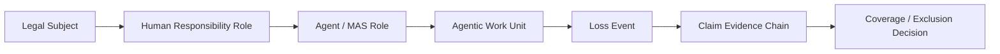

# Chapter 00
## The Plain-English Problem: Why Agentic AI Breaks Today’s Insurance Logic

Insurance still starts with plain questions: who is covered, what risk is covered, what happened, who was responsible, and what evidence supports the claim. [SRC: INS-04][SRC: INS-05][SRC: INS-06][SRC: CLAIM-01][SRC: CLAIM-02]

Public market examples show AI-specific cover at the edge, but they remain narrow, conditional, and product-specific rather than broad lifecycle risk transfer. [SRC: MKT-01][SRC: MKT-02][SRC: MKT-03][SRC: MKT-05][SRC: MKT-08]

This paper defines the bridge from policy subject to claim review as:
Legal Subject -> Human Responsibility Role -> Agent / MAS Role -> Agentic Work Unit -> Loss Event -> Claim Evidence Chain -> Coverage / Exclusion Decision. [SYNTHESIS: Jearon Wong][INT: INT-01][INT: INT-05][INT: INT-06]

### Bridge Figure

### Insurance Basics in Plain English

| Question | Plain-English answer | Why it matters for agentic AI | Source |
| --- | --- | --- | --- |
| Who is covered? | A person, firm, officer, vendor, or organization. | The AI system is not automatically the insured party. | [SRC: INS-04][SRC: INS-06][SRC: INS-08] |
| What is covered? | A policy-defined risk, limit, or exposure. | A model name or workflow label is not enough. | [SRC: INS-05][SRC: INS-07] |
| What happened? | A loss event with facts and timing. | Agentic work needs event reconstruction. | [SRC: CLAIM-01][SRC: CLAIM-02] |
| Who was responsible? | A mapped human or organizational role. | Responsibility cannot stay hidden inside automation. | [SRC: INS-01][INT: INT-01][INT: INT-05] |
| What evidence exists? | Records that support review. | Logs are inputs, not the full claim file. | [SRC: CLAIM-01][SRC: CLAIM-03][INT: INT-05] |

### Draft Body

The insurance problem is not that agentic AI is mysterious. It is that the usual insurance questions break apart when action, authority, and responsibility are split across a person, a company, a tool, a model, and a workflow. [SRC: INS-01][SRC: CLAIM-01][INT: INT-01]

AI governance sources already expect documentation, controls, and reviewability. That does not make those records insurance evidence by themselves, but it does show why the evidence question comes first. [SRC: INS-01][SRC: AI-01][SRC: AI-08][INT: INT-05]

### WP1 / WP2 Bridge

- WP1 contributes MROs, ALCS, accepted outcome, authority boundary, and remediation closure. [INT: INT-01][INT: INT-02]
- WP2 contributes the Audit Evidence Chain and the logs-versus-evidence distinction. [INT: INT-04][INT: INT-05]
- WP3 translates those into the claim-review and risk-transfer question. [SYNTHESIS: Jearon Wong]

### Boundary

- Not a coverage opinion.
- Not an underwriting standard.
- Not claims approval guidance.
- Not a legal liability determination.

### Draft Notes

- Keep the language accessible to readers who do not know agentic AI jargon.
- Introduce insurance terms before technical terms.
- Keep the first page oriented around the subject/object/evidence problem, not framework details.
