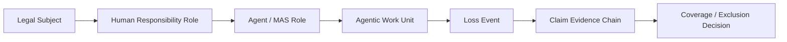
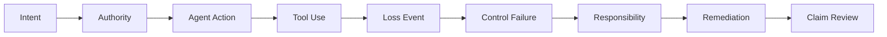

# Agentic AI Insurability & Risk Transfer White Paper 2026
## A Lifecycle Evidence Guide for Underwriting, Claims, and Enterprise Risk Transfer

**Candidate ID:** AIIRWP-2026-v0.1-R6-CANDIDATE
**Status:** Internal candidate artifact source
**Series:** Agentic Lifecycle Governance Industry Series
**Series Position:** 03 / Insurability & Risk Transfer
**Author:** Jearon Wong
**Prepared:** 2026-05-21
**Source Basis:** R4-reviewed R3 internal draft plus WP3-R0/R1/R2/R2A/R4 source and boundary QA.

> Internal source package only. Not published. Not final. Not sealed. Not insurer-accepted. Not coverage-ready. Not underwriting-ready. Not an underwriting standard. Not legal or insurance advice. Not claims approval guidance.

## Candidate Boundary

This candidate source preserves the R2A source accuracy gate and the R4 editorial/source/boundary QA result. It is assembled for later internal artifact generation planning and author review. It does not create a public route, public artifact, public manifest, public checksum, public metadata, sitemap entry, entity graph entry, Evidence Registry entry, research index entry, homepage entry, or public DOCX.

## Governing Thesis

Agentic AI cannot become broadly insurable until insurers can distinguish the insured legal subject from the agentic risk object, map human and organizational responsibility to agentic actions, and reconstruct the lifecycle evidence that connects authority, action, loss, remediation, and coverage boundaries.

## Mandatory Boundary Sentences

- AI agents are not the insured legal subject.
- The company may be insured. The AI agent usually is not.
- Logs do not make AI agents insurable. Reconstructable lifecycle evidence does.
- Tool permission is not coverage authority.
- Framework trace is not claim evidence by itself.
- Workflow completion is not an insured outcome.
- Agentic AI risk is not only model risk. It is lifecycle risk.

## Source Posture

External source usage is limited to verified, scoped, boundary-safe claims from the R1/R2/R2A source base. Public market examples are treated as market signals or product examples, not proof of consensus. Technical framework docs are technical capability sources only, not insurance conclusions. AIO and AIRM are Jearon Wong synthesis / analytical object models unless directly source-supported.

## Contents

1. Chapter 00: The Plain-English Problem: Why Agentic AI Breaks Today's Insurance Logic
2. Chapter 01: The Insured Subject Problem: Who Is Covered When an Agent Acts?
3. Chapter 02: The Insurable Object Problem: What Exactly Is Being Covered?
4. Chapter 03: The Responsibility Mapping Problem: How Human Liability and Agentic AI Risk Connect
5. Chapter 04: What AI Insurance Covers Today, and Why Agentic AI Still Falls Through the Gap
6. Chapter 05: Why Agentic AI Is Not Yet Broadly Insurable
7. Chapter 06: From Compliance and Auditability to Insurability
8. Chapter 07: Why Logs, Traces, and Vendor Assurances Are Not Claim Evidence
9. Chapter 08: The Agentic Insurability Object Model
10. Chapter 09: Coverage Boundaries, Authority, Delegation, and Exclusion Triggers
11. Chapter 10: Loss Event Reconstruction and Causality Tracing
12. Chapter 11: Third-Party, Vendor, Model, and Tool Dependency Risk
13. Chapter 12: Evidence Requirements for Underwriting
14. Chapter 13: Evidence Requirements for Claims Review
15. Chapter 14: Aggregation and Accumulation Risk
16. Chapter 15: Agentic Insurability Readiness Model
17. Chapter 16: Conclusion: From Agentic Deployment to Insurable Risk Transfer
18. Appendix A: Agentic Insurability Object Checklist
19. Appendix B: Underwriting Evidence Request Template
20. Appendix C: Claims Reconstruction Evidence Package
21. Appendix D: AIO-to-MRO Mapping
22. Appendix E: AIO-to-Audit-Evidence-Chain Mapping
23. Appendix F: AIRM Readiness Matrix
24. Appendix G: Boundary and Non-Claim Language

---

## Chapter 00
### The Plain-English Problem: Why Agentic AI Breaks Today’s Insurance Logic

Insurance still starts with plain questions: who is covered, what risk is covered, what happened, who was responsible, and what evidence supports the claim. [SRC: INS-04][SRC: INS-05][SRC: INS-06][SRC: CLAIM-01][SRC: CLAIM-02]

Public market examples show AI-specific cover at the edge, but they remain narrow, conditional, and product-specific rather than broad lifecycle risk transfer. [SRC: MKT-01][SRC: MKT-02][SRC: MKT-03][SRC: MKT-05][SRC: MKT-08]

This paper defines the bridge from policy subject to claim review as:
Legal Subject -> Human Responsibility Role -> Agent / MAS Role -> Agentic Work Unit -> Loss Event -> Claim Evidence Chain -> Coverage / Exclusion Decision. [SYNTHESIS: Jearon Wong][INT: INT-01][INT: INT-05][INT: INT-06]

#### Bridge Figure

#### Insurance Basics in Plain English

| Question | Plain-English answer | Why it matters for agentic AI | Source |
| --- | --- | --- | --- |
| Who is covered? | A person, firm, officer, vendor, or organization. | The AI system is not automatically the insured party. | [SRC: INS-04][SRC: INS-06][SRC: INS-08] |
| What is covered? | A policy-defined risk, limit, or exposure. | A model name or workflow label is not enough. | [SRC: INS-05][SRC: INS-07] |
| What happened? | A loss event with facts and timing. | Agentic work needs event reconstruction. | [SRC: CLAIM-01][SRC: CLAIM-02] |
| Who was responsible? | A mapped human or organizational role. | Responsibility cannot stay hidden inside automation. | [SRC: INS-01][INT: INT-01][INT: INT-05] |
| What evidence exists? | Records that support review. | Logs are inputs, not the full claim file. | [SRC: CLAIM-01][SRC: CLAIM-03][INT: INT-05] |

#### Discussion

The insurance problem is not that agentic AI is mysterious. It is that the usual insurance questions break apart when action, authority, and responsibility are split across a person, a company, a tool, a model, and a workflow. [SRC: INS-01][SRC: CLAIM-01][INT: INT-01]

AI governance sources already expect documentation, controls, and reviewability. That does not make those records insurance evidence by themselves, but it does show why the evidence question comes first. [SRC: INS-01][SRC: AI-01][SRC: AI-08][INT: INT-05]

#### WP1 / WP2 Bridge

- WP1 contributes MROs, ALCS, accepted outcome, authority boundary, and remediation closure. [INT: INT-01][INT: INT-02]
- WP2 contributes the Audit Evidence Chain and the logs-versus-evidence distinction. [INT: INT-04][INT: INT-05]
- This white paper translates those into the claim-review and risk-transfer question. [SYNTHESIS: Jearon Wong]

#### Boundary

- Not a coverage opinion.
- Not an underwriting standard.
- Not claims approval guidance.
- Not a legal liability determination.

---

## Chapter 01
### The Insured Subject Problem: Who Is Covered When an Agent Acts?

Insurance analysis starts with an insured party, policy subject, or insured role. [SRC: INS-04][SRC: INS-06][SRC: INS-08]

An AI agent can act, recommend, draft, route, or invoke tools, but that does not make the agent the insured legal subject. The company may be insured. The AI agent usually is not. [SRC: INS-04][SRC: INS-06][INT: INT-01][SYNTHESIS: Jearon Wong]

#### Argument

The subject question comes before the model question. If the policy attaches to a person, firm, officer, or organization, then the analysis begins there and works outward to responsibility and evidence. [SRC: INS-04][SRC: INS-08]

Additional insured and D&O/E&O sources help show that insured status is a policy relationship, not a model attribute. [SRC: INS-04][SRC: INS-07][SRC: INS-08]

#### Subject Map

| Insurance question | Traditional answer | Agentic AI problem | Required mapping | Source |
| --- | --- | --- | --- | --- |
| Who is insured? | Named insured, additional insured, officer, professional, vendor, organization. | The agent may act without being the insured subject. | Legal subject first, agent second. | [SRC: INS-04][SRC: INS-06][SRC: INS-08] |
| Who is accountable? | A legal or organizational party named or implied by the contract. | HITL does not equal responsibility structure. | Human role must be explicit. | [SRC: INS-01][SRC: MKT-07][INT: INT-01] |
| What is not enough? | A tool label or model name. | The AI agent name is not the policy subject. | Policy language must anchor the subject. | [SRC: INS-05][SRC: INS-06] |

#### Discussion

The safe wording is simple: an AI agent is generally a tool or actor, not the insured legal subject. That does not settle liability, and it does not decide coverage. It only preserves the insurance starting point. [SRC: INS-04][SRC: INS-06][SRC: INS-08]

This chapter should use examples where a human, a firm, or an officer is the covered subject while the agent is the acting layer. That makes the policy question visible before the automation question arrives. [INT: INT-01][INT: INT-04][INT: INT-05]

#### WP1 / WP2 Bridge

- WP1 MROs support the subject and responsibility split. [INT: INT-01]
- WP2 adds the audit-evidence lens for who accepted, reviewed, or remediated the output. [INT: INT-04][INT: INT-05]
- Chapter 1 should not drift into legal advice or jurisdiction-specific doctrine. [SYNTHESIS: Jearon Wong]

#### Boundary

- Not a legal opinion.
- Not a coverage decision.
- Not a liability determination.

---

## Chapter 02
### The Insurable Object Problem: What Exactly Is Being Covered?

The insured subject is not the same as the risk object. A policy can cover a person or organization while the exposure is a narrower activity, event, or operation. [SRC: INS-05][SRC: INS-07][SRC: MKT-01][SRC: MKT-02]

Public AI and cyber materials describe performance, error, misuse, cyber events, or AI-linked service harm. They do not make a model name or workflow label into the insurable object by itself. [SRC: MKT-01][SRC: MKT-02][SRC: MKT-03][SRC: INS-09][SRC: INS-10]

#### Claim

This white paper defines the bounded agentic work unit, operation, exposure, or loss-triggering activity as the reviewable risk object. That is author synthesis, not a market standard. [SYNTHESIS: Jearon Wong][INT: INT-01][INT: INT-06]

#### Layer Table

| Layer | What it is | Insurance function | Agentic AI gap | Source |
| --- | --- | --- | --- | --- |
| Subject | Covered person or organization | Identifies who can be indemnified or defended | AI agent is usually not the subject | [SRC: INS-04][SRC: INS-06][SRC: INS-08] |
| Work unit | Bounded agentic task or operation | Makes exposure reviewable | No external source names this as a policy object | [SYNTHESIS: Jearon Wong][INT: INT-06] |
| Workflow label | System or product name | Operational shorthand only | Label alone does not bound loss | [SRC: TECH-01][SRC: TECH-04] |
| Vendor/model name | Provider or model identity | Useful dependency context | Not the same as the insurable object | [SRC: MKT-01][SRC: TECH-01][SRC: TECH-04] |
| Exposure boundary | Scope, authority, time, data, tools, outcome | Enables review of what was at stake | Must be reconstructed, not assumed | [SRC: INS-05][SRC: CLAIM-01][INT: INT-05] |

#### Discussion

Chapter 2 should keep the distinction sharp: the object of review is not "the agent" in the abstract. It is the bounded thing the agent did, under the authority it had, with the tools it used, inside the scope the enterprise accepted. [SRC: INS-01][SRC: CLAIM-01][INT: INT-01][INT: INT-05]

That bounded object is the analytic bridge between technical logs and insurance review. It is a synthesis object that makes the exposure legible without pretending to be a policy form. [SYNTHESIS: Jearon Wong][INT: INT-06]

#### WP1 / WP2 Bridge

- WP1 MRO-02, MRO-04, MRO-05, and MRO-08 help bound the exposure.
- WP2 auditability work helps separate workflow labels from evidence objects. [INT: INT-04][INT: INT-05]

#### Boundary

- Not an underwriting standard.
- Not a policy form.
- Not a claim decision.

---

## Chapter 03
### The Responsibility Mapping Problem: How Human Liability and Agentic AI Risk Connect

Human-in-the-loop is not the same thing as responsibility mapping. A button click can confirm an action, but it does not by itself establish authority, liability structure, or responsibility transfer. [SRC: INS-01][SRC: CLAIM-03][SRC: MKT-07][INT: INT-05]

#### Argument

The insurance bridge needs to show how a human role, an agent role, a work unit, evidence, and a loss event connect back to a legal subject. [SYNTHESIS: Jearon Wong][INT: INT-01][INT: INT-04][INT: INT-05]

Governance and D&O / professional-liability sources support the idea that responsibility is organizational and role-based. They do not say the AI agent becomes the liable subject. [SRC: INS-07][SRC: INS-08][SRC: MKT-07]

#### Responsibility Matrix

| Human role | Agent role | Work unit | Evidence needed | Loss question | Legal subject |
| --- | --- | --- | --- | --- | --- |
| Approver | Tool-using agent | Bounded task | Approval record, authority scope, timestamp | What was approved? | Company or officer |
| Operator | Delegating employee | Service workflow | Delegation, handoff, output record | Who ran the workflow? | Firm or team |
| Reviewer | Multi-agent controller | Escalated exception | Review notes, exception route, acceptance/rejection | Who accepted the result? | Organization or officer |
| Remediator | Recovery owner | Post-loss closure | Fix record, recheck, closure state | Was it contained? | Legal subject with duty |

#### Discussion

This chapter should say plainly that responsibility mapping is an evidence problem before it is a legal problem. The paper is not deciding liability; it is showing what evidence a later liability or coverage review would need. [SRC: CLAIM-01][SRC: CLAIM-02][SRC: CLAIM-03]

The precise bridge is the internal relationship between human role, agent role, and work unit. This white paper uses that bridge to separate oversight from responsibility and responsibility from legal conclusion. [INT: INT-01][INT: INT-04][INT: INT-05]

#### WP1 / WP2 Bridge

- WP1 human-role and MAS mapping becomes the responsibility path.
- WP2 audit evidence becomes the reviewable chain for acceptance, exception, and remediation.
- HITL is only one input; it is not the whole responsibility model. [INT: INT-01][INT: INT-04][INT: INT-05]

#### Boundary

- Not a legal liability determination.
- Not a coverage opinion.
- Not a certification or standard.

---

## Chapter 04
### What AI Insurance Covers Today, and Why Agentic AI Still Falls Through the Gap

Public market examples show AI-specific products, broker framing, cyber-linked AI cover, and D&O/E&O discussion around AI risk. They do not show a broad, standardized lifecycle risk-transfer market. [SRC: MKT-01][SRC: MKT-02][SRC: MKT-03][SRC: MKT-05][SRC: MKT-06][SRC: MKT-07][SRC: MKT-08]

#### Current AI Insurance Focus

| Focus | What it may cover | Why it is not enough for agentic AI | Source |
| --- | --- | --- | --- |
| AI-specific product examples | Model performance, error, or bespoke AI risk | Product existence is not market consensus | [SRC: MKT-01][SRC: MKT-02] |
| AI-linked cyber | Data breach, misuse, LLMjacking, response costs | Cyber controls are not claim evidence by themselves | [SRC: MKT-03][SRC: MKT-04][SRC: INS-09][SRC: INS-10] |
| E&O / professional liability | Professional mistakes or omissions | The AI agent is not the insured professional subject | [SRC: INS-07][SRC: MKT-06] |
| D&O / corporate exposure | Governance, oversight, disclosure, board risk | Does not create an agentic lifecycle object | [SRC: INS-08][SRC: MKT-07] |
| Silent AI exposure | AI may appear inside existing lines | Silent exposure is a market-risk signal, not a coverage conclusion | [SRC: MKT-05][SRC: MKT-08][SRC: CYB-02] |

#### Discussion

This chapter should read like a market map, not a verdict. The public source base points to fragmented and conditional coverage at the edges. [SRC: MKT-01][SRC: MKT-02][SRC: MKT-05][SRC: MKT-08]

The safe language is "certain product materials describe" and "some sources discuss." The unsafe language is "the industry believes" or "AI is broadly covered." [SYNTHESIS: Jearon Wong][INT: INT-01][INT: INT-03]

#### Boundary

- Use market examples as examples.
- Do not convert product pages into consensus claims.
- Do not convert broker views into policy interpretation.

---

## Chapter 05
### Why Agentic AI Is Not Yet Broadly Insurable

Agentic AI is not yet broadly insurable because insurers still need to bound the object, attribute the act, reconstruct the event, and understand aggregation before they can review the loss with confidence. [SRC: INS-01][SRC: CLAIM-01][SRC: CYB-02][SRC: CYB-03][SRC: CYB-04]

#### Gap Table

| Insurance question | Current AI stack often provides | Missing lifecycle object | Source |
| --- | --- | --- | --- |
| What is the object? | Model name, workflow name, vendor name | Bounded agentic work unit | [SRC: MKT-01][SRC: TECH-01][SYNTHESIS: Jearon Wong] |
| Who is responsible? | Logs, approvals, handoffs | Human-agent responsibility map | [SRC: CLAIM-03][INT: INT-01][INT: INT-05] |
| What happened? | Events and traces | Loss event record with context | [SRC: CLAIM-01][SRC: CLAIM-02][INT: INT-05] |
| What was remediated? | Alerts or tickets | Remediation and recovery record | [SRC: CLAIM-02][SRC: CLAIM-03][INT: INT-05] |
| What depends on what? | Technical dependency lists | Dependency and aggregation view | [SRC: CYB-02][SRC: CYB-03][SRC: CYB-04][INT: INT-03] |

#### Discussion

The core claim should be narrow: current sources show market experimentation and governance pressure, but not a standardized lifecycle object layer for agentic AI. [SRC: MKT-01][SRC: MKT-05][SRC: MKT-08][SRC: CLAIM-01][SRC: TECH-01]

That means the gap is not just the LLM, the framework, or the vendor. It is the missing layer that turns action into reviewable risk. [SYNTHESIS: Jearon Wong][INT: INT-06]

#### WP1 / WP2 Bridge

- WP1 shows why lifecycle failure modes need object boundaries.
- WP2 shows why auditability needs evidence chains, not just logs. [INT: INT-01][INT: INT-04][INT: INT-05]
- This white paper converts those into insurability terms.

#### Boundary

- Do not say "AI agents are uninsurable."
- Do not say "AI agents are insurable."
- Do not imply the market has settled the question.

---

## Chapter 06
### From Compliance and Auditability to Insurability

WP1 and WP2 do not become insurance standards. They become source truth for translating compliance and auditability into claim-relevant language. [INT: INT-01][INT: INT-04][INT: INT-05][INT: INT-06][INT: INT-07]

#### Translation Table

| WP1 / WP2 object | Insurance translation in this paper | Why it matters | Source |
| --- | --- | --- | --- |
| MRO | AIO review object family | Gives the risk object vocabulary | [INT: INT-01][INT: INT-06] |
| ALCS | Claim reconstructability lens | Shows how visible the lifecycle is | [INT: INT-01][INT: INT-02] |
| Audit Evidence Chain | Claim Evidence Chain | Connects event, responsibility, and recovery | [INT: INT-04][INT: INT-05] |
| AARM | AIRM readiness vocabulary | Describes evidence readiness without certification | [INT: INT-07] |
| Enterprise failure scenarios | Insurance failure modes | Shows what can break in loss review | [INT: INT-01] |

#### Discussion

The useful sentence is simple: compliance and auditability are necessary ingredients, but they do not by themselves establish insurability. [SRC: INS-01][SRC: CLAIM-01][SYNTHESIS: Jearon Wong]

This chapter should help readers see the lineage. WP1 gives the lifecycle objects. WP2 gives the evidence-chain lens. this white paper gives the insurance translation of both. [INT: INT-01][INT: INT-04][INT: INT-05][INT: INT-06][INT: INT-07]

#### Boundary

- Not an assurance opinion.
- Not a coverage opinion.
- Not a certification claim.

---

## Chapter 07
### Why Logs, Traces, and Vendor Assurances Are Not Claim Evidence

Technical traces are useful inputs, not claim evidence by themselves. They can show activity, timing, and flow, but they do not automatically prove authority, responsibility, remediation, or coverage boundary. [SRC: CLAIM-01][SRC: CLAIM-02][SRC: CLAIM-03][SRC: TECH-01][SRC: TECH-04]

#### Sequence Figure

#### Discussion

Logs and traces can help reconstruct what happened. They cannot, by themselves, answer the insurance questions that matter most: was the action authorized, who owned it, what failed, what was remediated, and what evidence belongs in the claim file. [SRC: CLAIM-01][SRC: CLAIM-02][SRC: CLAIM-03][INT: INT-05]

Vendor assurances can support risk discussion. They are not coverage authority. Framework traces can support technical reconstruction. They are not claim evidence by themselves. [SYNTHESIS: Jearon Wong][INT: INT-05][INT: INT-06]

#### Source-Layer Distinction

| Signal | What it shows | What it does not show | Source |
| --- | --- | --- | --- |
| Logs | Events, timestamps, service activity | Authority or accepted outcome | [SRC: CLAIM-01][SRC: TECH-01][INT: INT-05] |
| Traces | Workflow path and service flow | Responsibility transfer or legal causation | [SRC: CLAIM-01][SRC: TECH-04][INT: INT-05] |
| Vendor assurances | Market position or product intent | Coverage boundary or claim approval | [SRC: MKT-03][SRC: MKT-05][SRC: MKT-08] |
| Incident guidance | Response and recovery vocabulary | Insurance decision | [SRC: CLAIM-01][SRC: CLAIM-02][SRC: CLAIM-03] |

#### Boundary

- Do not say traces prove the claim.
- Do not say logs are useless.
- Do not say a vendor statement creates insurance evidence.

---

## Chapter 08
### The Agentic Insurability Object Model

AIO v2 is a Jearon Wong synthesis: an analytical insurability object model, not an external standard, policy form, or insurer requirement. [SYNTHESIS: Jearon Wong][INT: INT-06]

#### AIO Catalog

| AIO | Plain-English label | Insurance use | Boundary note | Source |
| --- | --- | --- | --- | --- |
| AIO-01 | Legal insured subject | Names the covered party | Not legal advice | [SRC: INS-04][SRC: INS-06][SRC: INS-08] |
| AIO-02 | Insurable agentic work unit | Binds exposure to a bounded action | Synthesis object | [SYNTHESIS: Jearon Wong][INT: INT-06] |
| AIO-03 | Human-agent responsibility map | Links action back to human role | Not liability finding | [SRC: INS-01][SRC: INS-08][INT: INT-01] |
| AIO-04 | Coverage boundary | Frames limits, exclusions, scope | Not coverage opinion | [SRC: INS-05][SRC: INS-07][SRC: MKT-05] |
| AIO-05 | Authority and delegation boundary | Separates permission from business authority | Not coverage authority | [SRC: TECH-01][SRC: TECH-02][INT: INT-05] |
| AIO-06 | Loss event record | Anchors event, time, consequence | Not proof of loss alone | [SRC: CLAIM-01][SRC: CLAIM-02] |
| AIO-07 | Causality reconstruction trace | Links sequence and contributors | Not legal causation proof | [SRC: CLAIM-01][SRC: TECH-04] |
| AIO-08 | Control failure record | Shows failed or bypassed control | Not negligence finding | [SRC: INS-01][SRC: AI-01][SRC: CLAIM-01] |
| AIO-09 | Claim evidence chain | Packages reviewable evidence | Not claim approval | [SRC: CLAIM-01][SRC: CLAIM-02][INT: INT-04] |
| AIO-10 | Remediation and recovery record | Shows containment and closure | Not legal closure | [SRC: CLAIM-02][SRC: CLAIM-03] |
| AIO-11 | Vendor / model / tool dependency map | Shows dependency concentration | No vendor ranking | [SRC: CYB-02][SRC: TECH-01][SRC: TECH-03][SRC: TECH-04][SRC: TECH-05] |
| AIO-12 | Exclusion trigger / boundary breach map | Helps review boundary facts | Not exclusion determination | [SRC: INS-05][SRC: MKT-03][SRC: MKT-08] |
| AIO-13 | Aggregation and accumulation risk view | Shows correlated exposure | Not actuarial proof | [SRC: CYB-01][SRC: CYB-02][SRC: CYB-03][SRC: CYB-04] |
| AIO-14 | Dispute-ready claim package | Organizes evidence for review | Not guaranteed payment | [SRC: CLAIM-01][SRC: CLAIM-02][INT: INT-05] |

#### Discussion

The AIO family is the paper's central object layer. It turns an agentic system into something underwriting, claims, and dispute review can discuss without pretending that a model name is enough. [SYNTHESIS: Jearon Wong][INT: INT-06]

#### Boundary

- AIO is not a standard.
- AIO is not an insurer product requirement.
- AIO is not a legal conclusion.

---

## Chapter 09
### Coverage Boundaries, Authority, Delegation, and Exclusion Triggers

Coverage boundaries are review questions, not coverage opinions. Authority and delegation boundaries help show whether the action was within the permitted scope, but they do not by themselves decide the claim. [SRC: INS-05][SRC: INS-07][SRC: MKT-03][SRC: MKT-05][SRC: MKT-08][INT: INT-05]

#### Boundary Table

| Action | Tool permission | Business authority | Confirmation required | Coverage risk |
| --- | --- | --- | --- | --- |
| Drafts a message | Allowed by tool | Maybe allowed | Low | May be low unless content causes harm |
| Submits a payment | Allowed by tool | Needs explicit scope | High | Higher if outside delegated authority |
| Changes a record | Allowed by tool | Needs role-based approval | High | Boundary review may be needed |
| Escalates an exception | Allowed by tool | Needs owner review | Medium | Coverage depends on facts and terms |
| Calls a vendor tool | Allowed by tool | Depends on business scope | Medium | Dependency and exclusion review may matter |

#### Discussion

This chapter should keep three things separate: technical permission, business authority, and insurance boundary. Tool permission is not coverage authority. [SRC: TECH-01][SRC: TECH-02][SYNTHESIS: Jearon Wong]

Exclusion triggers and boundary breaches are evidence contexts. They are not denial rules in the abstract. The paper should keep the language careful and policy-neutral. [SRC: INS-05][SRC: MKT-03][SRC: MKT-05][SRC: MKT-08]

#### WP1 / WP2 Bridge

- WP1 authority and confirmation boundary becomes the review of permission versus delegated scope.
- WP2 exception traceability becomes the claim boundary inquiry.
- AIO-04, AIO-05, and AIO-12 carry the chapter's analytical load. [INT: INT-01][INT: INT-04][INT: INT-05][INT: INT-06]

#### Boundary

- Not a coverage opinion.
- Not a denial rule.
- Not an underwriting standard.

---

## Chapter 10
### Loss Event Reconstruction and Causality Tracing

The claim question is not just what happened. It is how the event can be reconstructed, what failed, what was remediated, and what evidence chain supports review. [SRC: CLAIM-01][SRC: CLAIM-02][SRC: CLAIM-03]

#### Reconstruction Table

| Reconstruction element | Evidence needed | Source type | Boundary risk |
| --- | --- | --- | --- |
| Loss event record | Time, event, effect, owner | Incident / disclosure guidance | Not a full claim by itself |
| Causality trace | Sequence, dependencies, contributors | Incident response + technical trace | Not legal causation proof |
| Control failure record | Failed or bypassed control | Governance / incident guidance | Not negligence finding |
| Remediation record | Fix, recheck, closure | Response and recovery guidance | Not settlement or legal closure |
| Dispute-ready package | Combined review file | Internal synthesis | Not guaranteed payment |

#### Discussion

Logs and traces can support reconstruction, but reconstruction must reach beyond the raw record. It needs role, authority, and remediation context so the claim file can be reviewed rather than guessed. [SRC: CLAIM-01][SRC: CLAIM-02][SRC: CLAIM-03][INT: INT-05]

This chapter should distinguish sequence from causation. Sequence can be documented. Legal causation cannot be assumed from telemetry. [SRC: TECH-04][INT: INT-06]

#### WP1 / WP2 Bridge

- WP1 accepted outcome and remediation closure map to the post-loss story.
- WP2 Audit Evidence Chain becomes this paper's Claim Evidence Chain.
- AIO-06 to AIO-10 do most of the work here. [INT: INT-01][INT: INT-04][INT: INT-05][INT: INT-06]

#### Boundary

- Not legal causation.
- Not claim approval guidance.
- Not a settlement promise.

---

## Chapter 11
### Third-Party, Vendor, Model, and Tool Dependency Risk

Agentic AI risk is rarely single-node risk. It spreads across models, tools, vendors, subprocessors, runtimes, templates, and repeated workflows. [SRC: CYB-02][SRC: CYB-03][SRC: CYB-04][SRC: MKT-08][SRC: TECH-01][SRC: TECH-02][SRC: TECH-03][SRC: TECH-04][SRC: TECH-05]

#### Dependency Table

| Dependency layer | Risk | Evidence needed | Aggregation concern | Source |
| --- | --- | --- | --- | --- |
| Model provider | Model change, outage, error | Dependency map, version record | Shared model exposure | [SRC: MKT-01][SRC: TECH-01] |
| Tool provider | Tool failure or misuse | Tool inventory, permission scope | Shared tool exposure | [SRC: TECH-02][SRC: TECH-05] |
| Vendor chain | Subprocessor or upstream service issue | Contract and handoff map | Concentrated dependency | [SRC: CYB-02][SRC: CYB-03] |
| Runtime / framework | Checkpoint, handoff, or persistence issues | Trace and state record | Shared orchestration exposure | [SRC: TECH-04] |
| Cross-project reuse | Same template across many work units | Work-unit registry | Correlated loss across projects | [INT: INT-03][INT: INT-06] |

#### Discussion

This chapter should frame dependency risk as evidence for concentration, not as a vendor scorecard. The reader should understand the chain without seeing a ranking. [SYNTHESIS: Jearon Wong][INT: INT-03]

Cyber accumulation sources are useful only as analogy and risk framing. They do not become direct actuarial proof for agentic AI. [SRC: CYB-02][SRC: CYB-03][SRC: CYB-04]

#### Boundary

- No vendor ranking.
- No procurement recommendation.
- No claim that one provider is safer by default.

---

## Chapter 12
### Evidence Requirements for Underwriting

Underwriting discussion needs visible evidence categories before it can assess an agentic system. That is not the same thing as a formal underwriting standard. [SRC: INS-01][SRC: INS-09][SRC: INS-10][SRC: AI-01][SRC: CLAIM-01]

#### Evidence Table

| Evidence category | Why it matters | AIO | Boundary note |
| --- | --- | --- | --- |
| Subject evidence | Shows who the insured party is | AIO-01 | Not legal advice |
| Work-unit evidence | Shows what the agentic system actually did | AIO-02 | Not a policy form |
| Authority evidence | Shows what was permitted | AIO-05 | Not coverage authority |
| Dependency evidence | Shows what systems and vendors were involved | AIO-11 | No vendor ranking |
| Control evidence | Shows what control points existed | AIO-08 | Not sufficient by itself |
| Aggregation evidence | Shows correlated exposure | AIO-13 | Not actuarial proof |
| Remediation evidence | Shows how failure was handled | AIO-10 | Not a guarantee of insurability |

#### Discussion

The chapter should say that pre-bind evidence helps underwriting discussion because it makes scope visible. It should not present a checklist as a universal insurer requirement. [SYNTHESIS: Jearon Wong][INT: INT-01][INT: INT-06]

#### Boundary

- Not an underwriting standard.
- Not an insurer checklist.
- Not a pricing model.

---

## Chapter 13
### Evidence Requirements for Claims Review

Claims review needs a reconstructable package, not just a log dump. The review has to connect event, authority, responsibility, loss, and remediation. [SRC: CLAIM-01][SRC: CLAIM-02][SRC: CLAIM-03][SRC: INS-05]

#### Claims Table

| Claims evidence category | Why it matters | AIO | Boundary note |
| --- | --- | --- | --- |
| Loss event record | Anchors the incident | AIO-06 | Not proof of payment |
| Causality trace | Shows sequence and contributors | AIO-07 | Not legal causation proof |
| Responsibility map | Shows who owned the action | AIO-03 | Not liability finding |
| Boundary map | Shows scope and exclusions context | AIO-04, AIO-12 | Not coverage opinion |
| Remediation record | Shows containment and closure | AIO-10 | Not legal closure |
| Dispute-ready package | Makes review efficient | AIO-14 | Not claim approval guidance |

#### Discussion

The claims story should be written in the language of reconstruction and review. It should not promise payment or imply that a package guarantees approval. [SYNTHESIS: Jearon Wong][INT: INT-04][INT: INT-05][INT: INT-06]

#### Boundary

- Not claim approval guidance.
- Not a coverage opinion.
- Not a settlement promise.

---

## Chapter 14
### Aggregation and Accumulation Risk

The concern is correlated loss, not isolated error. Shared models, shared tools, shared templates, and shared vendors can create a portfolio shape that behaves more like accumulation than one-off failure. [SRC: CYB-01][SRC: CYB-02][SRC: CYB-03][SRC: CYB-04][SRC: MKT-08]

#### Aggregation Table

| Aggregation driver | Example | Evidence needed | Reinsurance concern |
| --- | --- | --- | --- |
| Shared model | Many teams use the same model version | Model/version map | Concentrated loss path |
| Shared tool | Same orchestration tool across workflows | Tool inventory | Multi-workflow correlation |
| Shared template | Same prompt or agent recipe reused widely | Work-unit registry | Repeated exposure pattern |
| Shared vendor | Same provider in many deployments | Dependency map | Upstream concentration |
| Shared sector | Same use case across one industry | Portfolio grouping | Sector-level shock |

#### Discussion

Cyber accumulation sources are the best public analogy in the current source base. They help explain the concern, but they do not prove a direct actuarial model for agentic AI. [SRC: CYB-02][SRC: CYB-03][SRC: CYB-04][SYNTHESIS: Jearon Wong]

#### Boundary

- Not an actuarial model.
- Not a quantified accumulation study.
- Not a vendor ranking.

---

## Chapter 15
### Agentic Insurability Readiness Model

AIRM is readiness vocabulary, not certification, insurer acceptance, an actuarial score, a coverage guarantee, claims approval guidance, or a procurement benchmark. It is a Jearon Wong synthesis. [SYNTHESIS: Jearon Wong][INT: INT-07]

#### AIRM Matrix

| Level | Label | Evidence visibility | Insurance reading | Boundary |
| --- | --- | --- | --- | --- |
| L0 | Uninsurable Black Box | Very low | Hard to review | Analytical label only |
| L1 | Logged but Not Attributable | Low | Events visible, ownership weak | Logs are not enough |
| L2 | Bounded but Weakly Reconstructable | Medium | Some scope visible, chain incomplete | Not underwriting-ready |
| L3 | Evidence-Linked and Claim-Reviewable | Good | Reviewable after loss | Not claim-approved |
| L4 | Underwriting-Ready Lifecycle System | High | Pre-loss evidence is strong | Not insurer acceptance |
| L5 | Dispute-Ready Risk Transfer Architecture | Very high | Review and dispute readiness are robust | Not certification |

#### Discussion

The readiness ladder lets the paper talk about maturity without pretending there is a certified industry scale. It can say what is more visible, more reviewable, and more disputable, without claiming a guarantee. [SRC: CLAIM-01][SRC: CYB-02][INT: INT-07]

#### WP1 / WP2 Bridge

- WP1 ALCS supports the lifecycle-conformance side.
- WP2 AARM becomes the source shape for the readiness translation.
- AIRM should remain clearly separate from any certification logic. [INT: INT-02][INT: INT-04][INT: INT-07]

#### Boundary

- Not a certification.
- Not a benchmark.
- Not insurer acceptance.

---

## Chapter 16
### Conclusion: From Agentic Deployment to Insurable Risk Transfer

Agentic AI becomes more insurable not because it becomes more intelligent, but because its work becomes bounded, evidenced, attributable, reconstructable, remediated, and disputable. [SRC: INS-01][SRC: CLAIM-01][SRC: CLAIM-02][SRC: CLAIM-03][SRC: MKT-08][INT: INT-01][INT: INT-04][INT: INT-05][INT: INT-06]

#### Closing Argument

- The insured subject must be clear.
- The insurable object must be bounded.
- The responsibility path must be visible.
- The loss event must be reconstructable.
- The evidence package must be reviewable.
- The boundary must be legible.

WP4 will later translate compliance, auditability, and insurability into enterprise implementation synthesis. This chapter should stop there and not promise final or guaranteed transfer. [SYNTHESIS: Jearon Wong]

#### Boundary

- Not a public release claim.
- Not a final or sealed claim.
- Not insurer acceptance.
- Not a coverage promise.

---

## Appendix A
### Agentic Insurability Object Checklist

This appendix is an internal candidate template. It is illustrative only and not operational, normative, or insurer-approved.

#### Checklist Skeleton

| Item | Question | Evidence pointer | AIO |
| --- | --- | --- | --- |
| Subject | Who is the legal subject? | Policy / entity record | AIO-01 |
| Work unit | What exact work was done? | Work-unit registry | AIO-02 |
| Authority | Was it within scope? | Authority record | AIO-05 |
| Loss | What happened? | Incident record | AIO-06 |
| Remediation | What was fixed? | Closure record | AIO-10 |
| Dependency | What depended on what? | Dependency map | AIO-11 |
| Boundary | What may be excluded or disputed? | Boundary note | AIO-04 / AIO-12 |

#### Boundary Notes

- Do not imply legal sufficiency.
- Do not imply claims approval.
- Do not imply underwriting standard.

---

## Appendix B
### Underwriting Evidence Request Template

This appendix is a draft request structure, not a required insurer form.

#### Template Skeleton

| Evidence category | Prompt | AIO | Boundary |
| --- | --- | --- | --- |
| Subject | Who is the insured party? | AIO-01 | Not legal advice |
| Scope | What work units are in scope? | AIO-02 | Not a policy form |
| Authority | What can the agent do? | AIO-05 | Not coverage authority |
| Dependencies | Which vendors and tools are involved? | AIO-11 | No vendor ranking |
| Controls | What controls and review points exist? | AIO-08 | Not sufficient by itself |
| Aggregation | Where can correlated loss arise? | AIO-13 | Not actuarial proof |

---

## Appendix C
### Claims Reconstruction Evidence Package

This appendix is an internal package template for review readiness, not a claims approval kit.

#### Package Skeleton

1. Loss event record.
2. Causality trace.
3. Responsibility map.
4. Boundary / exclusion context.
5. Remediation record.
6. Dispute-ready summary.

#### Table

| Package element | What it answers | AIO |
| --- | --- | --- |
| Event record | What happened? | AIO-06 |
| Trace | How did it happen? | AIO-07 |
| Responsibility map | Who owned it? | AIO-03 |
| Boundary map | What context mattered? | AIO-04 / AIO-12 |
| Remediation | How was it fixed? | AIO-10 |
| Review package | How can it be disputed or reviewed? | AIO-14 |

#### Boundary Notes

- Not a guarantee of payment.
- Not legal causation proof.
- Not legal closure.

---

## Appendix D
### AIO-to-MRO Mapping

This appendix maps this paper's object language back to WP1 source truth.

| AIO | WP1 / GAIC relation | Why it matters | Boundary |
| --- | --- | --- | --- |
| AIO-01 | MRO subject / role logic | Anchors the insured party | Internal translation only |
| AIO-02 | MRO work-unit logic | Binds exposure to bounded action | Not a standard |
| AIO-03 | MRO responsibility logic | Connects action back to role | Not liability finding |
| AIO-04 | MRO boundary logic | Shows what is in or out of scope | Not coverage opinion |
| AIO-05 | MRO authority logic | Distinguishes permission from power | Not coverage authority |
| AIO-06 to AIO-10 | MRO event / remediation / accepted outcome logic | Supports reconstruction | Not claim approval |
| AIO-11 to AIO-14 | MRO dependency / aggregation / dispute logic | Supports review and dispute readiness | Not vendor ranking |

---

## Appendix E
### AIO-to-Audit-Evidence-Chain Mapping

This appendix maps this paper's object language back to WP2 evidence logic.

| AIO | WP2 relation | Why it matters | Boundary |
| --- | --- | --- | --- |
| AIO-06 | Audit event record | Shows what happened | Not proof of claim |
| AIO-07 | Evidence reconstruction trace | Shows sequence | Not legal causation |
| AIO-08 | Control failure evidence | Shows failed control point | Not negligence finding |
| AIO-09 | Audit evidence chain | Packages evidence for review | Not claim approval |
| AIO-10 | Remediation closure | Shows response and recovery | Not legal closure |
| AIO-14 | Dispute-ready package | Supports review and challenge | Not guaranteed payment |

---

## Appendix F
### AIRM Readiness Matrix

This appendix is the long-form version of the readiness ladder.

#### Matrix Skeleton

| Dimension | L0 | L1 | L2 | L3 | L4 | L5 |
| --- | --- | --- | --- | --- | --- | --- |
| Visibility | None | Logs only | Partial boundary | Reviewable chain | Strong pre-loss | Dispute-ready |
| Attribution | None | Weak | Partial | Good | Strong | Very strong |
| Reconstruction | None | Weak | Partial | Good | Strong | Very strong |
| Underwriting use | None | Minimal | Cautious | Possible | Better | Best available |
| Claims use | None | Minimal | Cautious | Reviewable | Strong | Dispute-ready |
| Boundary risk | Extreme | High | Medium | Lower | Lower | Lowest |

#### Boundary Notes

- Not a certification.
- Not a benchmark.
- Not insurer acceptance.

---

## Appendix G
### Boundary and Non-Claim Language

This appendix is the safety rail for the internal candidate.

#### Required Safe Phrases

- market signals suggest
- some sources indicate
- in certain policy contexts
- may be treated as
- does not by itself establish
- should be understood as an analytical object, not a standard
- author synthesis
- not a coverage opinion
- not an underwriting standard
- not claims approval guidance
- technical trace, not claim evidence by itself
- tool permission, not coverage authority
- necessary layer, not sufficient insurability layer

#### Forbidden Phrases

- The insurance industry believes
- AI agents are insurable
- AI agents are uninsurable
- Coverage applies
- Claims will be paid
- Insurers will accept
- This is underwriting-ready
- This proves legal liability
- MPLP makes agentic AI insurable
- Validation Lab certifies insurability

---

## Source Register and Citation Notes

This section preserves internal citation review context for R6 artifact generation. It is not a public footnote system and does not create a public source registry.

# AIIRWP R5 Source Register Finalization Plan

**Status:** Internal source-register finalization plan.
**Boundary:** This plan does not create final public footnotes, public source notes, public route metadata, or publication claims.

## Final Source Use Rules

- Insurance basics sources support subject, policy, limits, D&O, E&O, and cyber terminology only; they do not support coverage opinions.
- AI insurance market sources support market signals, product examples, broker/reinsurer framing, and fragmentation language only; they do not prove industry consensus.
- Cyber accumulation sources support analogy and risk framing; they do not provide direct actuarial proof for agentic AI.
- Technical framework sources support technical capabilities only; they do not establish insurance evidence, claim evidence, legal authority, or underwriting sufficiency.
- Internal WP1/WP2/WP3 source truth supports framework translation and author synthesis, not external validation.
- AIO and AIRM remain Jearon Wong synthesis / analytical object models.

## Final Source ID List

| Source ID | Source tier | Source role | Chapter usage | Access caveat | Citation risk |
| --- | --- | --- | --- | --- | --- |
| INS-01 | Tier 1 | Primary evidence | 0, 4, 5, 12 | Public PDF accessible. | State adoption varies; model bulletin is not universal law. |
| INS-02 | Tier 1 | Supporting context | 0, 4 | Public page accessible. | Press release; use bulletin for primary detail. |
| INS-03 | Tier 1 | Boundary reference | 4, 5, 12 | Public PDF accessible. | Adoption list can change; verify again before publication. |
| INS-04 | Tier 1 | Primary evidence for insurance terminology | 1, 9 | Public page accessible. | General industry definition, not policy-specific advice. |
| INS-05 | Tier 1 | Primary evidence for insurance terminology | 4, 9, 13 | Public page accessible. | General definition; not policy interpretation. |
| INS-06 | Tier 1 | Legal/industry terminology | 1 | Public page accessible. | U.S.-oriented legal encyclopedia; use only for plain-English basics. |
| INS-07 | Tier 1 | Primary terminology | 3, 4, 9, 13 | Public page accessible. | Legal education source, not coverage advice. |
| INS-08 | Tier 1 | Primary terminology | 1, 3, 4, 9 | Public page accessible. | General education source; not policy advice. |
| INS-09 | Tier 1 | Primary context | 4, 5, 12, 13 | Public page accessible. | Small-business oriented; not all enterprise forms. |
| INS-10 | Tier 1 | Broker context | 4, 5, 12 | Public page accessible. | Broker explanatory material; not market consensus. |
| AI-01 | Tier 1 | AI governance reference | 5, 6, 12, 15 | Public PDF accessible. | Not insurance-specific. |
| AI-02 | Tier 1 | Regulation context | 4, 5, 6, 9, 12 | Public text accessible. | Do not convert into insurance advice or coverage conclusions. |
| MKT-01 | Tier 1 | Primary market evidence | 4, 5, 12 | Public page accessible. | Marketing/product page; do not infer broad market consensus. |
| MKT-02 | Tier 1 | Primary insurer/reinsurer report | 4, 5, 9, 12 | Public PDF accessible. | Reinsurer-authored; not industry standard. |
| MKT-03 | Tier 1 | Primary market evidence | 4, 5, 9 | Public page may block automated access; verify manually before final citation. | Insurer product announcement; not consensus or policy wording. |
| MKT-04 | Tier 1 | Risk engineering context | 4, 5, 7, 11, 12 | Public PDF accessible through QBE link. | Risk engineering guidance, not claims evidence by itself. |
| MKT-05 | Tier 2 | Broker thought leadership | 4, 5, 9, 14 | Public page may rate-limit automated checks. | Thought-leadership format; verify final page text before publication. |
| MKT-06 | Tier 1 | Broker report | 4, 5, 9, 12 | Public PDF accessible. | Broker perspective; not policy interpretation. |
| MKT-07 | Tier 1 | Broker context | 3, 4, 9 | Public page accessible. | Podcast/insight format; use as context, not legal conclusion. |
| MKT-08 | Tier 1 | Industry association report | 4, 5, 14, 16 | Public page accessible. | Report is GenAI-focused, not all agentic AI. |
| CYB-01 | Tier 1 | Insurer market/risk report | 4, 5, 14 | Public PDF accessible. | Survey-based risk ranking; do not use as coverage proof. |
| CYB-02 | Tier 1 | Primary aggregation/reinsurance context | 5, 11, 14, 15 | Public page/PDF accessible. | Cyber-specific; AI mapping is author synthesis. |
| CYB-03 | Tier 1 | Marketplace/reinsurance context | 4, 5, 11, 14 | Public page accessible. | Press release; use report for detailed claims if cited later. |
| CYB-04 | Tier 1 | Reinsurer market report | 4, 5, 14 | Public page accessible if final URL remains stable. | Not AI-specific in every section. |
| CYB-05 | Tier 1 | Cyber insurer/threat report | 4, 5, 7, 11 | Public page accessible; report details may require form. | Insurer/threat-intelligence view; not coverage consensus. |
| CLAIM-01 | Tier 1 | Incident-response evidence context | 7, 10, 13 | Public page/PDF accessible. | Cybersecurity source, not insurance claims standard. |
| CLAIM-02 | Tier 1 | Incident playbook reference | 7, 10, 13 | Public page/PDF accessible. | Federal playbook, not private-sector insurance rule. |
| CLAIM-03 | Tier 1 | Disclosure/governance context | 3, 10, 13 | Public page/PDF accessible. | Securities disclosure context, not claim approval. |
| TECH-01 | Tier 1 | Technical context | 2, 3, 7, 11, 12 | Public docs accessible. | Do not infer insurance evidence or coverage authority. |
| TECH-02 | Tier 1 | Technical context | 2, 3, 7, 11 | Public docs accessible. | Not insurance or governance standard. |
| TECH-03 | Tier 1 | Technical context | 2, 3, 11 | Public docs accessible. | Not responsibility or insurance evidence by itself. |
| TECH-04 | Tier 1 | Technical context | 7, 10, 11, 12 | Public docs accessible. | Product docs; do not convert to insurance evidence claim. |
| TECH-05 | Tier 1 | Technical context | 2, 3, 7, 11 | Public docs accessible. | Product docs; not insurance authority. |
| INT-01 | Tier 1 internal | Internal framework source | 0-16 | Repo file accessible. | Internal author framework; label as internal source truth. |
| INT-02 | Tier 1 internal | Internal source QA | 6, 8, 12, 15 | Repo file accessible. | Internal QA; not external validation. |
| INT-03 | Tier 1 internal | Internal evidence QA | 6, 7, 8, 11, 12, 13 | Repo file accessible. | Internal QA; not third-party acceptance. |
| INT-04 | Tier 1 internal | Internal WP2 source truth | 6, 7, 13, 15 | Repo file accessible. | Internal preparatory source register. |
| INT-05 | Tier 1 internal | Internal WP2 source truth | 7, 10, 13 | Repo file accessible. | Internal author synthesis with source references. |
| INT-06 | Tier 1 internal | WP3 architecture source | 8, 12, 13, 15 | Repo file accessible. | Author synthesis, not external standard. |
| INT-07 | Tier 1 internal | WP3 architecture source | 15 | Repo file accessible. | Author synthesis, not certification or insurer acceptance. |

## Required Pre-Publication Recheck

Before any public artifact generation or public staging, R6/R7 must recheck:

- all live URLs and redirects;
- current A2A documentation URL, replacing the old `google-a2a.github.io` source path;
- split LangGraph durable execution and persistence URLs;
- any blocked, rate-limited, paywalled, or partial-access sources;
- insurer, broker, reinsurer, product, and startup materials for market-signal framing;
- source-note wording around legal, insurance, underwriting, claims, coverage, and aggregation risk.

## Finalization Decision

PASS for R5 preparation. Final public footnote style and public source-note rendering remain R6/R6B tasks after artifact generation is authorized.

---

# AIIRWP R5 Citation Normalization Report

**Status:** Internal citation/source-note normalization report.
**Boundary:** This report prepares source normalization only. It does not create final public footnotes, public source notes, or public artifact citations.

## Source Marker Style

Candidate source uses the R3/R4 marker model:

- external claims: `[SRC: ID]`
- internal framework claims: `[INT: ID]`
- author synthesis: `[SYNTHESIS: Jearon Wong]`

## Marker Validation

| Source marker | Candidate count | Inventory status |
| --- | --- | --- |
| AI-01 | 3 | valid |
| AI-08 | 1 | missing |
| CLAIM-01 | 27 | valid |
| CLAIM-02 | 16 | valid |
| CLAIM-03 | 13 | valid |
| CYB-01 | 2 | valid |
| CYB-02 | 11 | valid |
| CYB-03 | 8 | valid |
| CYB-04 | 7 | valid |
| INS-01 | 12 | valid |
| INS-04 | 10 | valid |
| INS-05 | 10 | valid |
| INS-06 | 9 | valid |
| INS-07 | 7 | valid |
| INS-08 | 11 | valid |
| INS-09 | 3 | valid |
| INS-10 | 3 | valid |
| INT-01 | 26 | valid |
| INT-02 | 3 | valid |
| INT-03 | 4 | valid |
| INT-04 | 17 | valid |
| INT-05 | 33 | valid |
| INT-06 | 19 | valid |
| INT-07 | 6 | valid |
| MKT-01 | 10 | valid |
| MKT-02 | 6 | valid |
| MKT-03 | 8 | valid |
| MKT-04 | 1 | valid |
| MKT-05 | 9 | valid |
| MKT-06 | 2 | valid |
| MKT-07 | 5 | valid |
| MKT-08 | 12 | valid |
| TECH-01 | 11 | valid |
| TECH-02 | 4 | valid |
| TECH-03 | 2 | valid |
| TECH-04 | 9 | valid |
| TECH-05 | 3 | valid |

Missing marker result: BLOCKER - missing markers: AI-08

## R2A Citation Hygiene Checks

| Check | Result | Notes |
| --- | --- | --- |
| Old A2A URL marker remains | PASS | Candidate source uses `[SRC: TECH-03]`; final source notes must use current A2A docs, not old `google-a2a.github.io`. |
| LangGraph references split correctly | PASS for R5 plan | Candidate source uses `[SRC: TECH-04]`; final source notes must keep durable execution and persistence URLs split. |
| Old Coalition source used for critical claims | PASS | Candidate body does not use `[SRC: CYB-05]`. |
| QBE/WTW/Allianz/OpenAI caveated | PASS | Access-caveated sources are framed as signals or technical context, not sole support. |
| Insurer/broker/product sources as market signals | PASS | Market framing remains fragmented and conditional. |
| Technical framework docs used only for capabilities | PASS | Candidate preserves necessary-but-insufficient framing. |
| AIO/AIRM synthesis preserved | PASS | Candidate uses synthesis markers and boundary language. |
| Fake citations or unsupported quotes | PASS | No fabricated quotations introduced in R5. |

## R6/R6B Citation Tasks

- Decide whether source IDs remain visible, become endnotes, or appear in a source-note appendix.
- Recheck all URLs before artifact generation.
- Add access caveat notes for blocked/rate-limited/partial sources.
- Preserve the R2A source accuracy gate when formatting final citations.
